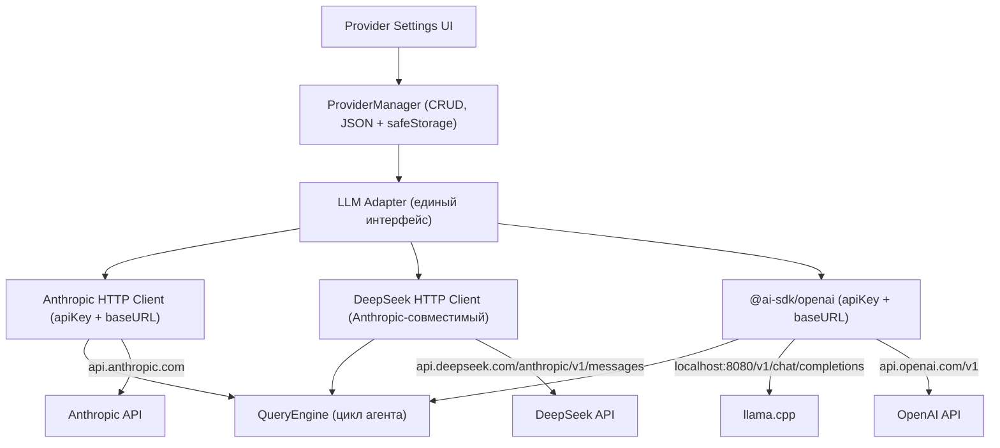
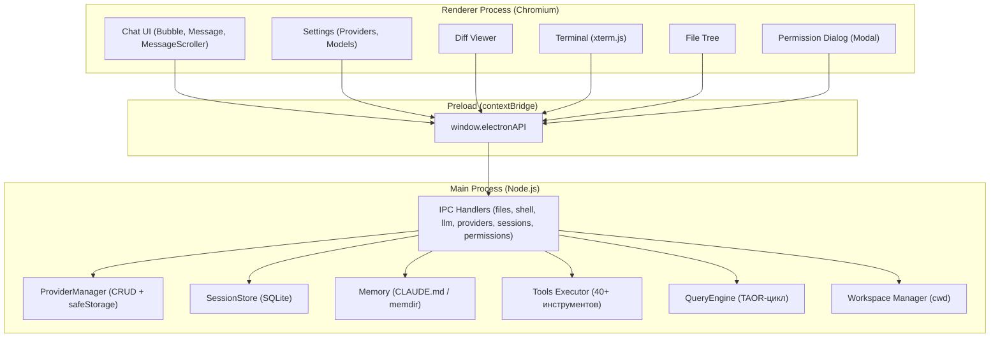

# Десктопный AI-агент на базе утекшего кода Claude Code

> Статус: НА РЕВЬЮ (v3 — автономный desktop/, открытые LLM-клиенты)
> Создан: 2026-07-06
> Последнее изменение: 2026-07-07

---

## 1. Цель

Создать десктопное приложение (Electron + React + shadcn/ui) — полноценного
AI-агента, который:
1. **Переиспользует** промпты, инструменты, систему памяти, навыки и движок
   запросов из утекшего кода Claude Code — скопированные в `desktop/src/vendor/leaked/`
2. **Поддерживает любого провайдера** (DeepSeek, llama.cpp, Anthropic,
   OpenAI-совместимые) с настройкой через UI
3. **Работает как нативное приложение** с доступом к файловой системе,
   терминалу и сети через Electron
4. **Полностью автономен**: `desktop/` можно скопировать на другой компьютер →
   `npm install && npm run dev` → работает без внешних зависимостей

---

## 2. Почему не `@anthropic-ai/sdk`

### Проблема

`@anthropic-ai/sdk` — проприетарный SDK Anthropic с рядом недостатков для
нашего проекта:

| Недостаток | Детали |
|-----------|--------|
| **Лицензионные риски** | SDK распространяется под MIT, но жёстко привязан к API Anthropic. Форк/модификация — серая зона |
| **Вендор-лок** | SDK работает ТОЛЬКО с Anthropic API. Для DeepSeek нужен хак с `baseURL`, для llama.cpp — отдельный OpenAI SDK |
| **Раздутый бандл** | ~500 КБ только SDK + зависимости. В проекте, где уже ~300-500 файлов утекшего кода, каждый мегабайт на счету |
| **Блокировка форматов** | Формат инструментов Anthropic несовместим с OpenAI. Конвертация туда-обратно — источник багов |
| **Нет контроля над HTTP** | Нельзя кастомизировать retry-логику, таймауты, перехват запросов под свои нужды |

### Решение: открытые альтернативы

| Вариант | Провайдеры | Размер | Лицензия |
|---------|-----------|--------|----------|
| **Vercel AI SDK** (`@ai-sdk/anthropic` + `@ai-sdk/openai`) | Anthropic, OpenAI, Google, Mistral, DeepSeek, llama.cpp | ~200 КБ | Apache 2.0 |
| **Свой HTTP-клиент** (тонкая обёртка над `fetch`) | Любые с HTTP API | ~5 КБ | Наш код |
| **OpenAI SDK** (`openai`) | OpenAI, llama.cpp, любые OpenAI-совместимые | ~300 КБ | Apache 2.0 |

**Рекомендация:** комбинированный подход:
- **Основной:** Vercel AI SDK — единый интерфейс для Anthropic и OpenAI-совместимых
- **DeepSeek:** прямой HTTP-клиент → `POST https://api.deepseek.com/anthropic/v1/messages`
  (Anthropic-совместимый Messages API)
- **llama.cpp:** `POST localhost:8080/v1/chat/completions` (OpenAI-совместимый)

### Сравнение интерфейсов

```ts
// Vercel AI SDK — единый интерфейс
import { generateText } from 'ai';
import { anthropic } from '@ai-sdk/anthropic';
import { openai } from '@ai-sdk/openai';

// Стриминг для Anthropic
const result = await streamText({
  model: anthropic('claude-sonnet-4-20250514'),
  messages: [...],
  tools: {...},
});

// Стриминг для OpenAI / llama.cpp
const result = await streamText({
  model: openai('gpt-4o'),
  messages: [...],
  tools: {...},
});
```

```ts
// Свой HTTP-клиент для DeepSeek (Anthropic-совместимый Messages API)
const response = await fetch('https://api.deepseek.com/anthropic/v1/messages', {
  method: 'POST',
  headers: {
    'Content-Type': 'application/json',
    'x-api-key': apiKey,
    'anthropic-version': '2023-06-01',
  },
  body: JSON.stringify({
    model: 'deepseek-chat',
    max_tokens: 4096,
    system: systemPrompt,
    messages: messages,
    tools: tools,
    stream: true,
  }),
});
```

---

## 3. Текущее состояние (аудит структуры)

### 3.1 Что есть в утекшем коде (проверено — существует)

**Архитектура агентного цикла (Think-Act-Observe-Repeat):**
```
while(true) {
  response = await LLM_API(messages, tools)  // Think
  messages.push(response)                     // Observe
  if (response.stop_reason === "end_turn") break
  toolResults = await executeTools(response.tool_uses)  // Act
  messages.push(toolResults)                  // Observe
}
```

Кодовое имя master-loop: `nO`. Только ~1.6% кода — AI-логика, остальное —
инфраструктура (permissions, контекст, роутинг инструментов, recovery).

**Ключевые модули (проверено: существуют на диске):**

| Модуль | Размер | Назначение |
|--------|--------|------------|
| `QueryEngine.ts` | ~800 строк | Движок агентного цикла |
| `query.ts` | ~300 строк | Подготовка одного запроса к API |
| `services/api/client.ts` | ~390 строк | Создание клиента API (заменяем на свой) |
| `services/api/claude.ts` | ~2000 строк | Стриминг, ретраи, обработка ошибок (заменяем) |
| `constants/prompts.ts` | ~54 КБ | Системные промпты агента |
| `constants/system.ts` | ~4 КБ | Системный префикс, фингерпринт |
| `tools/` (45 папок) | ~15 КБ | Все инструменты включая Bash, FileRead/Write/Edit, Glob, Grep, Agent, Task, MCP... |
| `memdir/` (8 файлов) | ~75 КБ | Память, CLAUDE.md, воспоминания |
| `skills/bundled/` (17 файлов) | ~500 строк | Встроенные навыки |
| `services/mcp/` (24 файла) | ~5 КБ | MCP интеграция |
| `utils/bash/parser.ts` | ~4.4 КБ строк | Безопасный парсер bash-команд |
| `utils/permissions/` (25 файлов) | ~10 КБ | Система разрешений |
| `utils/git.ts` + `gitDiff.ts` | ~46 КБ | Git-операции |

### 3.2 Что НЕ СУЩЕСТВУЕТ (критично — нужно создать)

| Файл | Импортируется из | Серьёзность |
|------|-----------------|-------------|
| **`types/message.ts`** | **180 файлов** | 🔴 КРИТИЧЕСКАЯ — центральный тип всей системы |

`types/message.ts` экспортирует ~30+ типов: `Message`, `AssistantMessage`, `UserMessage`,
`SystemMessage`, `NormalizedMessage`, `ProgressMessage`, `StreamEvent`,
`AttachmentMessage`, `SystemLocalCommandMessage`, `SystemAPIErrorMessage`,
`RenderableMessage`, `GroupedToolUseMessage`, `StopHookInfo`, `MessageOrigin` и др.

Восстановление потребует анализа импортов из 180 файлов и ручного создания
всех типов (~500-1000 строк TypeScript).

### 3.3 ПОЛНЫЙ АУДИТ: перепроверка (с учётом `.ts`/`.tsx`)

**Предыдущий аудит был неточен** — искал только `.js`, не учёл `.ts`/`.tsx`.
После перепроверки с поиском по всем расширениям:

| Категория | Кол-во |
|-----------|--------|
| TypeScript-файлов в кодовой базе | 1905 |
| Из них совпадают с renepardon/claude-code зеркалом | ~1890 |
| Реально отсутствует | **1 файл** — `types/message.ts` |
| Ложные срабатывания предыдущего аудита | **2109** (файлы есть с `.ts`/`.tsx`) |

**Причина ложных срабатываний:** импорты используют расширение `.js` (Bun-формат), аудитор не проверил существование `.ts`/`.tsx` аналогов.

**renepardon/claude-code** — идентичное зеркало, дополнительных файлов нет. Клонировать не нужно.

#### 🔴 ТОП-20: реальный статус после перепроверки

| # | Файл (в импортах `.js`) | Имп. | Реальный статус |
|---|--------------------------|------|-----------------|
| 1 | `ink.js` | 429 | ЕСТЬ `ink.tsx` ✅ |
| 2 | `utils/debug.js` | 347 | ЕСТЬ `utils/debug.ts` ✅ |
| 3 | `utils/errors.js` | 245 | ЕСТЬ `utils/errors.ts` ✅ |
| 4 | `bootstrap/state.js` | 226 | ЕСТЬ `bootstrap/state.ts` (1329 строк) ✅ |
| 5 | `utils/log.js` | 226 | ЕСТЬ `utils/log.ts` ✅ |
| 6 | `utils/envUtils.js` | 213 | ЕСТЬ `utils/envUtils.ts` ✅ |
| 7 | `utils/slowOperations.js` | 204 | ЕСТЬ `utils/slowOperations.ts` ✅ |
| 8 | `Tool.js` | 203 | ЕСТЬ `Tool.ts` (29KB) ✅ |
| 9 | `commands.js` | 170 | ЕСТЬ `commands.ts` (25KB) ✅ |
| 10 | `services/analytics/index.js` | 170 | ЕСТЬ → НЕ НУЖНО (аналитика) |
| 11 | `utils/config.js` | 165 | ЕСТЬ `utils/config.ts` (63KB) ✅ |
| 12 | `types/message.js` | 163 | 🔴 **НЕТ ни в `.ts`, ни в `.tsx`** — единственный реально отсутствующий |
| 13 | `utils/settings/settings.js` | 131 | ЕСТЬ `utils/settings/settings.ts` ✅ |
| 14 | `state/AppState.js` | 126 | ЕСТЬ `state/AppState.tsx` (23KB) ✅ |
| 15 | `utils/messages.js` | 125 | ЕСТЬ `utils/messages.ts` ✅ |
| 16 | `services/analytics/growthbook.js` | 112 | ЕСТЬ → НЕ НУЖНО (shim) |
| 17 | `utils/format.js` | 98 | ЕСТЬ `utils/format.ts` ✅ |
| 18 | `utils/lazySchema.js` | 95 | ЕСТЬ `utils/lazySchema.ts` ✅ |
| 19 | `keybindings/useKeybinding.js` | 94 | ЕСТЬ → НЕ НУЖНО (Ink UI) |
| 20 | `utils/fsOperations.js` | 93 | ЕСТЬ `utils/fsOperations.ts` ✅ |

**Итог: 19 из ТОП-20 «отсутствующих» — существуют с `.ts`/`.tsx` расширениями.**

#### 🎯 Инструменты — ВСЕ существуют

| Файл | Имп. | Статус |
|------|------|--------|
| `tools/BashTool/BashTool.tsx` | 17 | ✅ ЕСТЬ |
| `tools/FileReadTool/FileReadTool.ts` | 11 | ✅ ЕСТЬ |
| `tools/FileWriteTool/FileWriteTool.ts` | 8 | ✅ ЕСТЬ |
| `tools/FileEditTool/FileEditTool.ts` | 6 | ✅ ЕСТЬ |
| `tools/GlobTool/GlobTool.ts` | 5 | ✅ ЕСТЬ |
| `tools/GrepTool/GrepTool.ts` | 5 | ✅ ЕСТЬ |
| `tools/WebFetchTool/WebFetchTool.ts` | 4 | ✅ ЕСТЬ |
| `tools/WebSearchTool/WebSearchTool.ts` | 4 | ✅ ЕСТЬ |
| `tools/AgentTool/loadAgentsDir.ts` | 60 | ✅ ЕСТЬ |
| `tools/BashTool/toolName.ts` | 30 | ✅ ЕСТЬ |
| `tools/AgentTool/constants.ts` | 27 | ✅ ЕСТЬ |
| `tools/FileReadTool/prompt.ts` | 25 | ✅ ЕСТЬ |
| `tools/FileEditTool/constants.ts` | 24 | ✅ ЕСТЬ |
| `Task.ts` | 21 | ✅ ЕСТЬ |
| `tools/FileWriteTool/prompt.ts` | 19 | ✅ ЕСТЬ |
| `tools/BashTool/bashPermissions.ts` | 13 | ✅ ЕСТЬ |

**Вывод:** все 8 инструментов существуют. Писать заново не нужно.

#### 🎯 Утилиты — ВСЕ существуют

Все 6 «отсутствующих» утилит из предыдущего аудита найдены:

| Файл | Статус |
|------|--------|
| `utils/log.ts` | ✅ ЕСТЬ |
| `utils/slowOperations.ts` | ✅ ЕСТЬ |
| `utils/format.ts` | ✅ ЕСТЬ |
| `utils/lazySchema.ts` | ✅ ЕСТЬ |
| `utils/fsOperations.ts` | ✅ ЕСТЬ |
| `utils/debug.ts` | ✅ ЕСТЬ |

#### 🎯 API-слой — всё на месте (без изменений)

| Файл | Имп. | Статус |
|------|------|--------|
| `services/api/claude.ts` | 23 | ✅ ЕСТЬ (2000 строк) |
| `services/api/errors.ts` | 11 | ✅ ЕСТЬ |
| `services/api/client.ts` | 5 | ✅ ЕСТЬ (390 строк) |
| `services/api/logging.ts` | 3 | ✅ ЕСТЬ |

#### 🎯 Единственный реально отсутствующий: `types/message.ts`

163 импорта ссылаются на `types/message.js`. Файл отсутствует:
- Нет `types/message.ts`
- Нет `types/message.tsx`
- Нет в renepardon/claude-code зеркале

Это **единственный файл**, который нужно создать с нуля.

### 3.4 Оценка объёма восстановления

| Категория | Файлов | Строк |
|-----------|--------|-------|
| Существуют — копируем в vendor/ | ~300-500 | ~50 000 |
| Пишем заново: `types/message.ts` | 1 | ~500-1 000 |
| НЕ НУЖНЫ (аналитика, Ink UI, CLI) | ~1400 | 0 |
| **Итого писать заново** | **1** | **~500-1 000** |

**Стратегия для `types/message.ts`:**
1. Взять интерфейсы из `@anthropic-ai/sdk` (`ContentBlockParam`, `MessageParam`, etc.)
2. Взять типы из `Tool.ts` (`ToolUseBlock`, `ToolResultBlock`)
3. Взять типы из `Task.ts` (`TaskType`, `TaskStatus`)
4. Создать файл с ~30 типами на основе импортов из 180 файлов

### 3.4 Что НЕ берём (пишем с нуля)

| Модуль | Причина |
|--------|--------|
| `ink/` (~50 файлов) | Терминальный React-рендерер → заменяем на HTML/CSS |
| `components/` (~200 файлов) | UI для терминала → заменяем на React + shadcn/ui |
| `cli/`, `commands/` | CLI-интерфейс → заменяем на UI/меню |
| `bridge/` (~20 файлов) | Удалённые сессии → не нужно |
| `buddy/` | Тамагочи → опционально, не в MVP |
| `entrypoints/` | Точки входа CLI → пишем свои |
| `bootstrap/` | Глобальное состояние → shim с ~15 экспортами |
| `hooks/` (~80 файлов) | React-хуки для терминала → заменяем |
| `coordinator/` | Координатор агентов → MVP без него |
| `services/api/client.ts` | Anthropic SDK клиент → заменяем на свой HTTP-клиент |
| `services/api/claude.ts` | Anthropic-специфичный стриминг → заменяем на адаптер |

---

## 4. Желаемый результат

### 4.1 Функциональность

1. **Чат-интерфейс**: сообщения пользователя ↔ ответы ассистента, Markdown,
   подсветка кода, стриминг
   - Используем shadcn/ui: Attachment, Bubble, Message, Marker, Message Scroller
2. **AI-агент** с полным циклом Think-Act-Observe-Repeat и всеми инструментами Claude Code
3. **Мульти-провайдер**: Anthropic, DeepSeek (через HTTP-клиент,
   эндпоинт `/anthropic/v1/messages`), llama.cpp (OpenAI-совместимый),
   OpenAI-совместимые — добавление/редактирование через UI
4. **Выбор модели** внутри провайдера
5. **Файловые операции**: чтение, запись, редактирование (diff), поиск (grep/glob)
6. **Терминал**: выполнение bash/powershell команд
7. **Веб-инструменты**: fetch, web search
8. **CLAUDE.md и память**: автозагрузка/автосохранение контекста проекта
9. **История сессий**: сохранение/поиск/восстановление
10. **Diff Viewer**: просмотр изменений с Accept/Reject
11. **Плагины и Skills**: встроенные + возможность добавления
12. **Системный трей**: работа в фоне, уведомления
13. **Выбор рабочей директории**: UI для выбора/переключения workspace
14. **Диалоги разрешений**: ask/allow/deny для опасных операций (модальные окна)
15. **Шифрование API-ключей**: через Electron `safeStorage`

### 4.2 Нефункциональные требования

- Автономность: копирование `desktop/` → `npm install && npm run dev` → работает
- Воспроизводимая сборка: никаких импортов из родительских папок
- Размер: Electron .exe < 300 МБ
- Память: < 500 МБ в покое
- Время холодного старта: < 5 секунд
- Поддержка Windows 10+, macOS 12+, Linux

---

## 5. Архитектурные решения

### 5.1 Стек технологий

| Слой | Технология | Почему |
|------|-----------|--------|
| Runtime | Electron 33 | Доступ к Node.js API + Chromium для UI |
| Frontend | React 19 + TypeScript | Переиспользуем типы и логику |
| UI Kit | shadcn/ui (Radix + Tailwind) | Готовые компоненты: Attachment, Bubble, Message, Marker, Message Scroller, Card, Dialog, Sheet |
| State | Zustand | Лёгкий стейт-менеджер без boilerplate |
| База | better-sqlite3 | SQLite для истории |
| LLM Client | Свой HTTP-клиент + `@ai-sdk/openai` | Открытый код, никакого вендор-лока |
| Бандлер | Vite (через electron-vite) | Vite для renderer + сборка main/preload |
| Сборка | electron-builder | .exe/.dmg/.AppImage |
| Шифрование | Electron safeStorage | DPAPI (Win) / Keychain (Mac) / libsecret (Linux) |
| Терминал | node-pty + xterm.js | Настоящая эмуляция терминала |

### 5.2 Архитектура мульти-провайдера



**Подтверждено:**
- DeepSeek предоставляет Anthropic-совместимый Messages API:
  `POST https://api.deepseek.com/anthropic/v1/messages`
- llama.cpp предоставляет OpenAI-совместимый Chat Completions API:
  `POST localhost:8080/v1/chat/completions`

### 5.3 Архитектура Electron (процессы)



### 5.4 Стратегия интеграции с утекшим кодом

**Копируем, а не импортируем.** Все нужные файлы из утекшего кода копируются
в `desktop/src/vendor/leaked/`. Никаких импортов из родительских папок.

**Структура `desktop/src/vendor/leaked/`:**
```
desktop/src/vendor/leaked/
├── tools/                    # все 45 папок инструментов
├── constants/                # prompts.ts, system.ts, xml.ts, tools.ts,
│                             #   common.ts, figures.ts, files.ts,
│                             #   turnCompletionVerbs.ts
├── memdir/                   # все 8 файлов
├── skills/
│   └── bundled/              # 17 файлов
├── services/
│   ├── api/
│   │   ├── errors.ts
│   │   └── logging.ts
│   └── mcp/                  # 24 файла
├── types/
│   ├── permissions.ts
│   ├── command.ts
│   ├── ids.ts
│   └── message.ts            # СОЗДАТЬ (180 файлов импортируют)
├── utils/
│   ├── bash/                 # 4 файла
│   ├── permissions/          # 25 файлов
│   ├── git.ts
│   ├── gitDiff.ts
│   ├── envUtils.ts
│   ├── array.ts
│   ├── errors.ts
│   ├── format.ts
│   ├── json.ts
│   └── markdown.ts
├── QueryEngine.ts
├── query.ts
├── cost-tracker.ts
├── Tool.ts
├── Task.ts
└── commands.ts
```

Плюс все транзитивные зависимости (~300-500 файлов).

**Настройка tsconfig paths:**
```json
// desktop/tsconfig.json
{
  "compilerOptions": {
    "paths": {
      "@vendor/tools/*": ["./src/vendor/leaked/tools/*"],
      "@vendor/constants/*": ["./src/vendor/leaked/constants/*"],
      "@vendor/services/*": ["./src/vendor/leaked/services/*"],
      "@vendor/utils/*": ["./src/vendor/leaked/utils/*"],
      "@vendor/memdir/*": ["./src/vendor/leaked/memdir/*"],
      "@vendor/skills/*": ["./src/vendor/leaked/skills/*"],
      "@vendor/types/*": ["./src/vendor/leaked/types/*"],
      "@vendor/query": ["./src/vendor/leaked/query.ts"],
      "@vendor/QueryEngine": ["./src/vendor/leaked/QueryEngine.ts"]
    }
  }
}
```

```ts
// desktop/vite.config.ts (main процесс)
resolve: {
  alias: {
    'bun:bundle': resolve('src/main/shims/bun-bundle.ts'),
    'src/bootstrap/state.js': resolve('src/main/shims/bootstrap-state.ts'),
    'src/utils/crypto.js': resolve('src/main/shims/crypto.ts'),
    '@vendor': resolve('src/vendor/leaked'),
  }
}
```

**Критично для shim-ов:** Vite `resolve.alias` перехватывает импорты `bun:bundle`
и `src/bootstrap/state.js` на уровне бандлера. Импорты, которые использовали
абсолютные пути `src/*`, перенаправляются на shim'ы или конвертируются
в относительные/алиасные внутри `desktop/`.

### 5.5 Механизм IPC-стриминга

`AsyncIterable` нельзя передать через `ipcMain.handle()`. Вместо этого:

```ts
// Main: webContents.send() для каждого события
for await (const event of llmAdapter.createMessageStream(params)) {
  mainWindow.webContents.send('chat:token', event);
}
mainWindow.webContents.send('chat:done');

// Preload: exposing event listeners
contextBridge.exposeInMainWorld('electronAPI', {
  onChatToken: (cb: (event: LLMEvent) => void) => {
    ipcRenderer.on('chat:token', (_e, data) => cb(data));
  },
  onChatDone: (cb: () => void) => {
    ipcRenderer.on('chat:done', () => cb());
  },
  removeChatListeners: () => {
    ipcRenderer.removeAllListeners('chat:token');
    ipcRenderer.removeAllListeners('chat:done');
  },
});
```

### 5.6 Шифрование API-ключей

```ts
// ProviderManager: шифрование через Electron safeStorage
import { safeStorage } from 'electron';

function encryptApiKey(plainText: string): string {
  return safeStorage.encryptString(plainText).toString('base64');
}

function decryptApiKey(encrypted: string): string {
  return safeStorage.decryptString(Buffer.from(encrypted, 'base64'));
}
```

### 5.7 Компромиссы

| Решение | Плюс | Минус |
|---------|------|-------|
| Electron вместо Tauri | Переиспользуем TS-логику | Размер > 200MB |
| Копирование vendor/ в desktop/ | Полная автономность, нет внешних зависимостей | Дублирование ~300-500 файлов |
| Свой HTTP-клиент вместо @anthropic-ai/sdk | Открытый код, контроль над HTTP, меньше размер | Нужно писать/поддерживать клиент |
| ~300-500 файлов vendor/ | Полная функциональность Claude Code | Сложность поддержки |
| Vite resolve.alias для shim'ов | Не трогаем vendor-код | Магия бандлера, сложнее отладка |

---

## 6. Структура `desktop/`

```
desktop/
├── package.json
├── tsconfig.json
├── vite.config.ts
├── tailwind.config.js
├── postcss.config.js
├── electron-builder.yml
├── components.json
├── src/
│   ├── main/
│   │   ├── index.ts              # точка входа Electron
│   │   ├── tray.ts               # системный трей
│   │   ├── ipc/
│   │   │   ├── index.ts          # регистрация всех IPC-обработчиков
│   │   │   ├── chat.ts           # чат + стриминг
│   │   │   ├── files.ts          # файловые операции
│   │   │   ├── shell.ts          # терминал
│   │   │   ├── providers.ts      # CRUD провайдеров
│   │   │   ├── sessions.ts       # история сессий
│   │   │   ├── permissions.ts    # диалоги разрешений
│   │   │   └── workspace.ts      # рабочая директория
│   │   ├── services/
│   │   │   ├── provider-manager.ts
│   │   │   ├── session-store.ts
│   │   │   ├── memory.ts
│   │   │   ├── skills.ts
│   │   │   └── settings.ts
│   │   ├── llm/
│   │   │   ├── adapter.ts        # единый интерфейс LLMAdapter
│   │   │   ├── anthropic-client.ts   # HTTP-клиент для Anthropic API
│   │   │   ├── deepseek-client.ts    # HTTP-клиент для DeepSeek
│   │   │   └── openai-client.ts      # @ai-sdk/openai обёртка
│   │   ├── agent/
│   │   │   ├── index.ts          # оркестрация агента
│   │   │   └── ...               # адаптированные копии из vendor
│   │   └── shims/
│   │       ├── bun-bundle.ts     # feature() → false
│   │       ├── bootstrap-state.ts # ~15 экспортов глобального состояния
│   │       └── crypto.ts         # randomUUID из node:crypto
│   ├── preload/
│   │   └── index.ts              # contextBridge API
│   ├── renderer/                 # React-приложение
│   │   ├── index.html
│   │   ├── main.tsx
│   │   ├── App.tsx
│   │   ├── components/
│   │   │   ├── chat/             # ChatView, MessageInput, MarkdownViewer,
│   │   │   │                     #   ToolCallBubble, PermissionDialog
│   │   │   ├── settings/         # ProviderSettings, ProviderForm, GeneralSettings
│   │   │   ├── diff/             # DiffViewer, DiffFileList
│   │   │   ├── shell/            # Terminal
│   │   │   ├── files/            # FileTree
│   │   │   ├── sessions/         # SessionList, SessionSearch
│   │   │   ├── skills/           # SkillList
│   │   │   └── workspace/        # WorkspacePicker
│   │   └── stores/
│   │       ├── chatStore.ts
│   │       ├── providerStore.ts
│   │       ├── settingsStore.ts
│   │       └── sessionStore.ts
│   ├── shared/
│   │   └── types/
│   │       └── provider.ts       # LLMProvider, LLMEvent типы
│   └── vendor/
│       └── leaked/               # ~300-500 файлов из утекшего кода
│           ├── tools/            # все 45 папок инструментов
│           ├── constants/        # prompts, system, xml, tools, common...
│           ├── memdir/           # 8 файлов
│           ├── skills/bundled/   # 17 файлов
│           ├── services/
│           │   ├── api/          # errors.ts, logging.ts
│           │   └── mcp/          # 24 файла
│           ├── types/            # permissions, command, ids, message
│           ├── utils/            # bash, permissions, git, ...
│           ├── QueryEngine.ts
│           ├── query.ts
│           ├── cost-tracker.ts
│           ├── Tool.ts
│           ├── Task.ts
│           └── commands.ts
```

---

## 7. Детальные шаги реализации

### ЭТАП 0: Подготовка (критические зависимости)

---

#### Шаг 0.1: Восстановление `types/message.ts`

**Файл:** `desktop/src/vendor/leaked/types/message.ts` (НЕ СУЩЕСТВУЕТ — создать)

**Что делаем:**
1. Собрать все импорты из 180 файлов, которые используют `types/message.ts`
2. Определить список ~30+ типов: `Message`, `AssistantMessage`, `UserMessage`,
   `SystemMessage`, `NormalizedMessage`, `ProgressMessage`, `StreamEvent`,
   `AttachmentMessage`, `SystemLocalCommandMessage`, `SystemAPIErrorMessage`,
   `RenderableMessage`, `GroupedToolUseMessage`, `StopHookInfo`, `MessageOrigin`,
   `ToolUseSummaryMessage`, `SystemInformationalMessage`, `SystemApiMetricsMessage`,
   `SystemBridgeStatusMessage`, `SystemCompactBoundaryMessage`,
   `SystemMicrocompactBoundaryMessage`, `SystemTurnDurationMessage`,
   `SystemPermissionRetryMessage`, `HookResultMessage`, `CollapsedReadSearchGroup`,
   `SystemMessageLevel`, `PartialCompactDirection`, `NormalizedUserMessage`,
   `NormalizedAssistantMessage`, `RequestStartEvent`, `TombstoneMessage`
3. Создать файл с полными TypeScript-типами (на основе интерфейсов из утекшего
   кода: `Tool.ts`, `Task.ts`, и Anthropic API типов)
4. Проверить: `tsc --noEmit` не выдаёт ошибок импорта типов

**Ожидаемый результат:** `types/message.ts` существует, 180 файлов его
импортируют без ошибок.

---

#### Шаг 0.2: Копирование vendor-файлов

**Что делаем:**
1. Создать структуру `desktop/src/vendor/leaked/`
2. Скопировать все необходимые модули из утекшего кода:
   - `tools/` (45 папок)
   - `constants/` (8 файлов: prompts, system, xml, tools, common, figures, files, turnCompletionVerbs)
   - `memdir/` (8 файлов)
   - `skills/bundled/` (17 файлов)
   - `services/api/errors.ts`, `services/api/logging.ts`
   - `services/mcp/` (24 файла)
   - `types/permissions.ts`, `types/command.ts`, `types/ids.ts`
   - `utils/bash/` (4 файла), `utils/permissions/` (25 файлов)
   - `utils/git.ts`, `utils/gitDiff.ts`, `utils/envUtils.ts`, `utils/array.ts`
   - `utils/errors.ts`, `utils/format.ts`, `utils/json.ts`, `utils/markdown.ts`
   - `QueryEngine.ts`, `query.ts`, `cost-tracker.ts`, `Tool.ts`, `Task.ts`, `commands.ts`
3. Скопировать транзитивные зависимости (~200-300 дополнительных файлов)
4. Проверить: `find desktop/src/vendor/leaked -name '*.ts' | wc -l` → 300-500

**Ожидаемый результат:** `desktop/src/vendor/leaked/` содержит ~300-500 файлов.

---

#### Шаг 0.3: Полный shim для `bootstrap/state.ts`

**Файл:** `desktop/src/main/shims/bootstrap-state.ts`

**Что делаем:**
1. Проанализировать все экспорты `bootstrap/state.ts` (исходный файл — 1329 строк)
2. Определить полный список ~15 экспортов, нужных для импортируемых модулей:
   - `getSessionId`, `setSessionId`, `getIsNonInteractiveSession`
   - `getOriginalCwd`, `setOriginalCwd`, `getProjectRoot`
   - `getTotalCostUSD`, `addToTotalCostState`, `resetCostState`
   - `getModelUsage`, `getTokenCounter`, `getCostCounter`
   - `getTotalInputTokens`, `getTotalOutputTokens`, `getTotalAPIDuration`
   - `setAdditionalDirectoriesForClaudeMd`, `setIsRemoteMode`
   - `setMainLoopModelOverride`, `setTeleportedSessionInfo`
   - `hasDevChannels`, `isSessionPersistenceDisabled`
   - `getSessionCounter`, `setMeter`
3. Создать моки: `getSessionId() → crypto.randomUUID()`, счётчики → 0
4. Проверить: импорт из shim не вызывает ошибок

**Ожидаемый результат:** все импорты `bootstrap/state.js` резолвятся через
Vite alias, функции возвращают безопасные значения по умолчанию.

---

#### Шаг 0.4: Аудит инструментов на Bun/Node-совместимость

**Файлы:** все 45 папок в `desktop/src/vendor/leaked/tools/`

**Что делаем:**
1. Запустить grep по всем файлам инструментов:
   ```
   grep -r "Bun\.\|bun:\|import.meta\.dir\|import.meta\.file\|import.meta\.require" desktop/src/vendor/leaked/tools/
   ```
2. Составить список инструментов, использующих Bun-специфичные API
3. Для каждого проблемного инструмента определить стратегию: shim, адаптация,
   или исключение из десктопной версии
4. Проверить использование `require()` в .ts файлах (Bun поддерживает,
   Vite/Node — через createRequire)

**Ожидаемый результат:** документированный список инструментов с пометками
«совместим» / «требует shim» / «исключён».

---

### ЭТАП 1: Проект и провайдеры

---

#### Шаг 1.1: Инициализация Electron + React + Vite

**Файлы:**
- Создать: `desktop/package.json`
- Создать: `desktop/tsconfig.json`
- Создать: `desktop/vite.config.ts` (с resolve.alias для shim'ов и @vendor)
- Создать: `desktop/tailwind.config.js`
- Создать: `desktop/postcss.config.js`
- Создать: `desktop/electron-builder.yml`
- Создать: `desktop/components.json` (конфиг shadcn/ui)
- Создать: `desktop/src/main/index.ts`
- Создать: `desktop/src/preload/index.ts`
- Создать: `desktop/src/renderer/index.html`
- Создать: `desktop/src/renderer/main.tsx`
- Создать: `desktop/src/renderer/App.tsx`

**Что делаем:**
1. `npm create @quick-start/electron` или electron-vite как шаблон
2. Настраиваем Vite `resolve.alias`:
   - `bun:bundle` → `src/main/shims/bun-bundle.ts`
   - `src/bootstrap/state.js` → `src/main/shims/bootstrap-state.ts`
   - `src/utils/crypto.js` → `src/main/shims/crypto.ts`
   - `@vendor` → `src/vendor/leaked`
3. Настраиваем tsconfig paths для `@vendor/*` алиасов
4. Настраиваем Tailwind + shadcn/ui
5. Инициализируем shadcn: `npx shadcn@latest init`
6. Добавляем компоненты: `npx shadcn@latest add attachment bubble message marker
   message-scroller card dialog sheet tabs button input select textarea
   dropdown-menu tooltip scroll-area table badge`
7. Настраиваем electron-builder для Win/Mac/Linux
8. Добавляем `@electron/rebuild` в postinstall скрипт
9. Создаём `window.electronAPI` через contextBridge

**Ожидаемый результат:** `npm run dev` открывает Electron-окно с React +
shadcn/ui компонентами. Никаких импортов из родительских папок.

---

#### Шаг 1.2: Shim-пакеты (расширенные)

**Файлы:**
- Создать: `desktop/src/main/shims/bun-bundle.ts`
- Создать: `desktop/src/main/shims/bootstrap-state.ts` (полный — из шага 0.3)
- Создать: `desktop/src/main/shims/crypto.ts`

**Что делаем:**
1. `bun:bundle` shim: `export const feature = (flag: string) => false`
2. `bootstrap/state.ts` shim: ~15 экспортов (из шага 0.3)
3. `crypto.ts` shim: `export { randomUUID } from 'node:crypto'`
4. Настраиваем Vite `resolve.alias` для перехвата импортов (из шага 1.1)

**Ожидаемый результат:** импорты `bun:bundle`, `bootstrap/state.js`,
`utils/crypto.js` резолвятся в shim'ы.

---

#### Шаг 1.3: Типы и модель провайдера (+ safeStorage)

**Файлы:**
- Создать: `desktop/src/shared/types/provider.ts`
- Создать: `desktop/src/main/services/provider-manager.ts`

**Что делаем:**
1. Интерфейс `LLMProvider`:
   ```ts
   interface LLMProvider {
     id: string; name: string;
     type: 'anthropic' | 'deepseek' | 'openai';
     baseURL: string; apiKey: string; // apiKey хранится зашифрованным в JSON
     models: Array<{ id: string; name: string; contextWindow: number }>;
     defaultModel: string; enabled: boolean;
   }
   ```
2. `ProviderManager`:
   - `getAll()` — загрузить, расшифровать ключи
   - `add(provider)` — зашифровать ключ, сохранить
   - `update(id, partial)` — перешифровать ключ если изменён
   - `remove(id)` — удалить
   - `getActive()` / `setActive(id)`
   - Шифрование: `safeStorage.encryptString()` / `decryptString()`
3. Предустановленные провайдеры:
   - Anthropic (`api.anthropic.com`, HTTP-клиент)
   - DeepSeek (`api.deepseek.com/anthropic/v1/messages`, HTTP-клиент)
   - llama.cpp (`localhost:8080/v1/chat/completions`, OpenAI-клиент, apiKey пустой)

**Ожидаемый результат:** провайдеры сохраняются с зашифрованными ключами.

---

#### Шаг 1.4: LLM-адаптер

**Файлы:**
- Создать: `desktop/src/main/llm/adapter.ts`
- Создать: `desktop/src/main/llm/anthropic-client.ts`
- Создать: `desktop/src/main/llm/deepseek-client.ts`
- Создать: `desktop/src/main/llm/openai-client.ts`

**Что делаем:**
1. Интерфейс `LLMAdapter.createMessageStream()`:
   ```ts
   interface LLMAdapter {
     createMessageStream(params: {
       model: string; messages: Message[]; system: string | string[];
       tools: ToolDefinition[]; maxTokens: number; signal?: AbortSignal;
     }): AsyncIterable<LLMEvent>;
   }
   ```
2. `AnthropicClient` — тонкий HTTP-клиент для Messages API:
   - `POST https://api.anthropic.com/v1/messages`
   - Заголовки: `x-api-key`, `anthropic-version: 2023-06-01`
   - Стриминг через SSE (Server-Sent Events)
3. `DeepSeekClient` — HTTP-клиент для DeepSeek Anthropic-совместимого API:
   - `POST https://api.deepseek.com/anthropic/v1/messages`
   - Те же заголовки, та же схема сообщений и инструментов
4. `OpenAIClient` — обёртка над `@ai-sdk/openai`:
   - Для llama.cpp: `baseURL: 'http://localhost:8080/v1'`
   - **Конвертация инструментов:** Anthropic tool schema → OpenAI function schema
5. Типы событий:
   ```ts
   type LLMEvent =
     | { type: 'text_delta'; text: string }
     | { type: 'tool_use'; id: string; name: string; input: object }
     | { type: 'message_stop' }
     | { type: 'error'; error: Error }
   ```

**Ожидаемый результат:** можно отправить запрос к любому провайдеру через
единый интерфейс. Никакой зависимости от `@anthropic-ai/sdk`.

---

#### Шаг 1.5: UI провайдеров

**Файлы:**
- Создать: `desktop/src/renderer/stores/providerStore.ts`
- Создать: `desktop/src/renderer/components/settings/ProviderSettings.tsx`
- Создать: `desktop/src/renderer/components/settings/ProviderForm.tsx`

**Используемые shadcn/ui компоненты:** `Table`, `Dialog`, `Button`, `Input`,
`Select`, `Sheet`

**Что делаем:**
1. Таблица провайдеров: имя, тип, baseURL, статус
2. Кнопка «Добавить» → `Sheet` или `Dialog` с формой
3. Кнопка «Редактировать» / «Удалить»
4. Выбор активного провайдера (Radio)
5. Секция моделей

**Ожидаемый результат:** через UI добавляем/редактируем провайдеров.

---

### ЭТАП 2: Чат и агент

---

#### Шаг 2.1: Адаптация QueryEngine

**Файлы (копируем из `vendor/leaked/`, адаптируем в `src/main/agent/`):**
- `vendor/leaked/QueryEngine.ts` → `src/main/agent/QueryEngine.ts`
- `vendor/leaked/query.ts` → `src/main/agent/query.ts`
- `vendor/leaked/cost-tracker.ts` → `src/main/agent/cost-tracker.ts`

**Что меняем (17 замен импортов):**
1. `bun:bundle` → shim ✓
2. `src/bootstrap/state.js` (7 импортов) → shim или локальные переменные
3. `src/services/api/claude.js` → наш `llm/adapter.ts`
4. `src/services/api/logging.js` (EMPTY_USAGE) → `@vendor/services/api/logging`
5. `src/entrypoints/agentSdkTypes.js` → копируем типы
6. `./state/AppState.js` → Zustand store или inline
7. `./hooks/useCanUseTool.js` → упрощённая версия
8. `./utils/abortController.js` → `new AbortController()`
9. `./utils/config.js` (getGlobalConfig) → ProviderManager
10. `./utils/cwd.js` (getCwd) → `process.cwd()`
11. `./utils/fileHistory.js`, `fileStateCache.js` → адаптированные версии
12. `./utils/headlessProfiler.js` → удалить
13. `./utils/hooks/hookHelpers.js` → упростить
14. `./utils/log.js`, `debug.js` → адаптировать
15. `./utils/model/model.js` → скопировать нужные функции
16. `./utils/plugins/pluginLoader.js` → адаптировать
17. `./utils/processUserInput/*.js` → адаптировать для Desktop UI

**Ожидаемый результат:** QueryEngine компилируется, генерирует правильные
запросы через наш LLM-адаптер.

---

#### Шаг 2.2: Адаптация промптов

**Файлы (копируем из `vendor/leaked/`):**
- `vendor/leaked/constants/prompts.ts` → `src/main/agent/prompts.ts`
- `vendor/leaked/constants/system.ts` → `src/main/agent/system.ts`

**Что меняем (10 замен):**
1. `feature()` → shim (`false` для всех флагов)
2. `getIsNonInteractiveSession` → `false`
3. `getCanonicalName/getMarketingNameForModel` → копируем из `utils/model/model.ts`
4. `getInitialSettings` → настройки из ProviderManager
5. `isReplModeEnabled` → импорт из инструментов
6. `isScratchpadEnabled`, `getScratchpadDir` → адаптировать
7. `shouldUseGlobalCacheScope` → `false`
8. `isForkSubagentEnabled` → `false`
9. `getFeatureValue_CACHED_MAY_BE_STALE` → `false`
10. Импорты с абсолютными путями → `@vendor/*` или относительные

**Плейсхолдеры:** `{PROVIDER_NAME}`, `{MODEL_NAME}` подставляются динамически.

**Ожидаемый результат:** промпты генерируются для любого провайдера.

---

#### Шаг 2.3: IPC-обработчики (расширенные)

**Файлы:**
- `desktop/src/main/ipc/index.ts` — регистрация
- `desktop/src/main/ipc/chat.ts` — чат + стриминг
- `desktop/src/main/ipc/files.ts` — файлы
- `desktop/src/main/ipc/shell.ts` — терминал
- `desktop/src/main/ipc/providers.ts` — CRUD провайдеров
- `desktop/src/main/ipc/sessions.ts` — сессии
- `desktop/src/main/ipc/permissions.ts` — ask/allow/deny диалоги
- `desktop/src/main/ipc/workspace.ts` — выбор/смена рабочей директории

**IPC-каналы (renderer → main):**

```ts
// Чат (стриминг через webContents.send)
'chat:send'           → { message, sessionId? } → main начинает send('chat:token', ...)
'chat:abort'          → void (прерывает AbortController)

// Инструменты
'tool:read-file'      → { path, offset?, limit? } → string
'tool:write-file'     → { path, content } → void
'tool:edit-file'      → { path, oldText, newText } → void
'tool:run-bash'       → { command, cwd, timeout? } → { stdout, stderr, exitCode }
'tool:grep'           → { pattern, path?, include? } → Match[]
'tool:glob'           → { pattern, cwd } → string[]
'tool:web-fetch'      → { url, method, headers?, body? } → string
'tool:web-search'     → { query } → SearchResult[]

// Провайдеры
'providers:list'      → LLMProvider[]
'providers:add'       → { provider } → void
'providers:update'    → { id, changes } → void
'providers:remove'    → { id } → void
'providers:setActive' → { id } → void

// Сессии
'sessions:list'       → SessionMeta[]
'sessions:get'        → { id } → Session
'sessions:delete'     → { id } → void
'sessions:search'     → { query } → SessionMeta[]

// Разрешения
'permissions:ask'     → { message, tool, details } → 'allow' | 'deny' | 'allowOnce'

// Рабочая директория
'workspace:get'       → string
'workspace:set'       → { path } → void
'workspace:pick'      → void → string | null (открывает диалог выбора папки)
'workspace:list-files' → { path } → FileEntry[]

// Настройки
'settings:get'        → AppSettings
'settings:update'     → { changes } → void
```

**Стриминг (chat:send):**
```ts
// Main процесс
ipcMain.on('chat:send', async (event, { message, sessionId }) => {
  const adapter = getAdapter();
  const stream = adapter.createMessageStream({ ... });
  for await (const evt of stream) {
    event.sender.send('chat:token', evt);
  }
  event.sender.send('chat:done');
});
```

**Ожидаемый результат:** все 25+ IPC-каналов работают.

---

#### Шаг 2.4: Чат-интерфейс (renderer)

**Файлы:**
- `desktop/src/renderer/stores/chatStore.ts`
- `desktop/src/renderer/components/chat/ChatView.tsx`
- `desktop/src/renderer/components/chat/MessageInput.tsx`
- `desktop/src/renderer/components/chat/MarkdownViewer.tsx`
- `desktop/src/renderer/components/chat/ToolCallBubble.tsx`
- `desktop/src/renderer/components/chat/PermissionDialog.tsx`

**Используемые shadcn/ui компоненты:**
- `Bubble` (sent/received) — пузыри сообщений
- `Message` — контейнер сообщения (список сообщений)
- `Message Scroller` — автопрокрутка
- `Attachment` — вложения/файлы
- `Marker` — индикаторы статуса
- `Card` — карточка инструмента
- `Dialog` — модальное окно разрешений
- `Button`, `Textarea`, `Input`

**Что делаем:**
1. ChatView: `Message Scroller` с автопрокруткой
2. Сообщения пользователя: `Bubble variant="sent"`
3. Ответы ассистента: `Bubble variant="received"` + `MarkdownViewer`
4. Вызовы инструментов: `Card` + `Marker` для статуса (pending/running/done/error)
5. Индикатор стриминга
6. `PermissionDialog` — модальное окно с кнопками Allow/Deny/Allow Once
7. `MessageInput` с поддержкой Shift+Enter, вставки файлов через `Attachment`

**Zustand chatStore:**
```ts
interface ChatStore {
  messages: Message[];
  isStreaming: boolean;
  partialText: string;
  activeToolCalls: ToolCall[];
  pendingPermission: PermissionRequest | null;
  sendMessage: (text: string) => Promise<void>;
  abortGeneration: () => void;
  resolvePermission: (decision: 'allow' | 'deny' | 'allowOnce') => void;
}
```

**Ожидаемый результат:** полноценный чат со стримингом, инструментами и
разрешениями.

---

#### Шаг 2.5: Интеграция агента

**Файлы:**
- `desktop/src/main/agent/index.ts`

**Поток выполнения:**
```
1. Пользователь → sendMessage()
2. IPC 'chat:send' → main
3. main: загружает CLAUDE.md/memdir (memory.ts)
4. main: формирует системный промпт (prompts.ts + CLAUDE.md + память)
5. main: QueryEngine.start({ messages, tools, provider })
6. QueryEngine: Think → LLMAdapter.createMessageStream()
7. LLM: text_delta → стримим в renderer (chat:token)
8. LLM: tool_use → выполняем инструмент → результат в messages
9. Если инструмент требует разрешения → permissions:ask → модальный диалог
10. Повтор с шага 6, пока stop_reason !== "end_turn"
11. Сохраняем сессию в SQLite
```

**Ожидаемый результат:** полный цикл TAOR с DeepSeek — проверено на реальном
ключе.

---

### ЭТАП 3: Десктопные фичи

---

#### Шаг 3.1: Diff Viewer

**Файлы:**
- `desktop/src/renderer/components/diff/DiffViewer.tsx`
- `desktop/src/renderer/components/diff/DiffFileList.tsx`

**Используемые shadcn/ui:** `Card`, `Button`, `Badge`, `ScrollArea`

**Что делаем:**
1. Левая панель: список изменённых файлов
2. Правая: unified diff с подсветкой (react-syntax-highlighter)
3. Кнопки Accept/Reject для каждого изменения

---

#### Шаг 3.2: История сессий

**Файлы:**
- `desktop/src/main/services/session-store.ts`
- `desktop/src/renderer/components/sessions/SessionList.tsx`
- `desktop/src/renderer/stores/sessionStore.ts`

**SQLite схема:**
```sql
CREATE TABLE sessions (
  id TEXT PRIMARY KEY,
  title TEXT,       -- генерируется из первого сообщения или авто
  provider_id TEXT,
  model TEXT,
  cwd TEXT,
  created_at INTEGER,
  updated_at INTEGER
);
CREATE TABLE messages (
  id INTEGER PRIMARY KEY AUTOINCREMENT,
  session_id TEXT REFERENCES sessions(id),
  role TEXT, content TEXT,
  tool_name TEXT, tool_input TEXT, tool_output TEXT,
  timestamp INTEGER
);
```

**Используемые shadcn/ui:** `Table`, `Input` (поиск), `ScrollArea`, `Dialog`

---

#### Шаг 3.3: Терминал и файловый менеджер

**Файлы:**
- `desktop/src/renderer/components/shell/Terminal.tsx`
- `desktop/src/renderer/components/files/FileTree.tsx`

**Зависимости:** `node-pty`, `xterm`, `xterm-addon-fit`

**⚠️ Windows:** node-pty требует Visual Studio Build Tools + Python.
Добавить в README.

---

#### Шаг 3.4: Навыки (Skills)

**Файлы:**
- `desktop/src/main/services/skills.ts`
- `desktop/src/renderer/components/skills/SkillList.tsx`

Импорт из `@vendor/skills/bundled/` + `@vendor/skills/bundledSkills.ts`

---

#### Шаг 3.5: Системный трей и уведомления

**Файлы:**
- `desktop/src/main/tray.ts`

---

#### Шаг 3.6: Выбор рабочей директории

**Файлы:**
- `desktop/src/main/ipc/workspace.ts`
- `desktop/src/renderer/components/workspace/WorkspacePicker.tsx`

**Используемые shadcn/ui:** `Dialog`, `Button`, `Input`

**Что делаем:**
1. Заголовок окна: текущая рабочая директория
2. Кнопка «Выбрать папку» → `dialog.showOpenDialog()`
3. При смене — перезагружаем CLAUDE.md, обновляем дерево файлов

---

#### Шаг 3.7: Сборка установщика

**Файлы:**
- `desktop/electron-builder.yml`
- `desktop/package.json` (скрипты + @electron/rebuild)

---

## 8. Затрагиваемые файлы

### 8.1 Восстанавливаемые (отсутствуют в утекшем коде)

| Файл | Строк | Зависит от |
|------|-------|-----------|
| `desktop/src/vendor/leaked/types/message.ts` | ~500-1000 | Импортируется 180 файлами |

### 8.2 Создаваемые (в `desktop/`)

**Конфигурация (7):**
`package.json`, `tsconfig.json`, `vite.config.ts`, `tailwind.config.js`,
`postcss.config.js`, `electron-builder.yml`, `components.json`

**Main процесс (22):**
`src/main/index.ts`, `src/main/tray.ts`,
`src/main/ipc/{index,chat,files,shell,providers,sessions,permissions,workspace}.ts`,
`src/main/services/{provider-manager,session-store,memory,skills,settings}.ts`,
`src/main/llm/{adapter,anthropic-client,deepseek-client,openai-client}.ts`,
`src/main/agent/index.ts`,
`src/main/shims/{bun-bundle,bootstrap-state,crypto}.ts`

**Preload (1):** `src/preload/index.ts`

**Renderer (23):**
`src/renderer/{index.html,main.tsx,App.tsx}`,
`src/renderer/components/chat/{ChatView,MessageInput,MarkdownViewer,ToolCallBubble,PermissionDialog}.tsx`,
`src/renderer/components/settings/{ProviderSettings,ProviderForm,GeneralSettings}.tsx`,
`src/renderer/components/diff/{DiffViewer,DiffFileList}.tsx`,
`src/renderer/components/shell/Terminal.tsx`,
`src/renderer/components/files/FileTree.tsx`,
`src/renderer/components/sessions/{SessionList,SessionSearch}.tsx`,
`src/renderer/components/skills/SkillList.tsx`,
`src/renderer/components/workspace/WorkspacePicker.tsx`,
`src/renderer/stores/{chat,provider,settings,session}Store.ts`

**Shared (1):** `src/shared/types/provider.ts`

**Итого создаваемых:** ~54 файла.

### 8.3 Копируемые в `desktop/src/vendor/leaked/` (~300-500 файлов)

Прямые импорты: `tools/*` (45 папок), `constants/*` (8), `memdir/*` (8),
`skills/bundled/*` (17), `services/mcp/*` (24), `types/*` (4+),
`utils/bash/*` (4), `utils/permissions/*` (25), `utils/git.ts`,
`utils/gitDiff.ts`, `utils/envUtils.ts`, `utils/array.ts`, `utils/errors.ts`,
`utils/format.ts`, `utils/json.ts`, `utils/markdown.ts`,
`services/api/errors.ts`, `services/api/logging.ts`, `state/AppState.tsx`,
`hooks/useCanUseTool.tsx`, `entrypoints/agentSdkTypes.ts`, `utils/messages.ts`,
`utils/fileHistory.ts`, `utils/fileStateCache.ts`, `utils/log.ts`,
`utils/debug.ts`, `QueryEngine.ts`, `query.ts`, `cost-tracker.ts`,
`Tool.ts`, `Task.ts`, `commands.ts`.

Транзитивные зависимости добавляют ещё ~200-300 файлов.

---

## 9. Зависимости

### npm-пакеты (desktop/package.json)

```json
{
  "devDependencies": {
    "electron": "^33.0.0",
    "electron-builder": "^25.0.0",
    "electron-vite": "^2.0.0",
    "@electron/rebuild": "^3.6.0",
    "@vitejs/plugin-react": "^4.0.0",
    "typescript": "^5.5.0",
    "tailwindcss": "^3.4.0",
    "postcss": "^8.0.0",
    "autoprefixer": "^10.0.0",
    "@types/better-sqlite3": "^7.0.0",
    "@types/react": "^19.0.0",
    "@types/react-dom": "^19.0.0"
  },
  "dependencies": {
    "react": "^19.0.0",
    "react-dom": "^19.0.0",
    "zustand": "^5.0.0",
    "@ai-sdk/openai": "^1.0.0",
    "better-sqlite3": "^11.0.0",
    "xterm": "^5.3.0",
    "xterm-addon-fit": "^0.8.0",
    "node-pty": "^1.0.0",
    "react-markdown": "^9.0.0",
    "react-syntax-highlighter": "^15.0.0",
    "remark-gfm": "^4.0.0",
    "lucide-react": "^0.400.0",
    "class-variance-authority": "^0.7.0",
    "clsx": "^2.1.0",
    "tailwind-merge": "^2.5.0",
    "zod": "^3.23.0"
  }
}
```

**Изменения относительно v2:**
- ❌ Удалён `@anthropic-ai/sdk` — заменён на свой HTTP-клиент
- ❌ Удалён `openai` — заменён на `@ai-sdk/openai`
- ➕ Добавлен `@ai-sdk/openai` — для OpenAI-совместимых провайдеров

### Песочница (sandbox-runtime)

**Источник:** [`anthropic-experimental/sandbox-runtime`](https://github.com/anthropic-experimental/sandbox-runtime)
— открытый репозиторий (Apache 2.0, 4600⭐, 348 форков).

**Что это:** ОС-level песочница для ограничения файловой системы и сети.
20 файлов TypeScript (~300 КБ): `SandboxManager` (70 КБ), платформенные утилиты
для Windows (WFP, 49 КБ), macOS (sandbox-exec, 37 КБ), Linux (seccomp, 58 КБ),
HTTP/HTTPS/SOCKS прокси, MITM-сертификаты.

**Статус в плане:** ⚠️ **ЭКСПЕРИМЕНТАЛЬНЫЙ** — нестабильный API, открытые issues (131),
отсутствие гарантий. **НЕ включается в MVP.** План на будущее:

| Этап | Действие |
|------|----------|
| **Сейчас** | Оставить shim из `patches/@anthropic-ai/sandbox-runtime/` (уже работает) |
| **v1.1** | Скопировать пакет в `desktop/src/vendor/sandbox-runtime/`, провести аудит API |
| **v1.2** | Адаптировать под Electron (child_process вместо прямых spawn) |
| **v1.3** | Заменить shim на реальную интеграцию, покрыть тестами |

**Почему не сразу:** песочница — OS-level (запускает изолированные процессы).
В MVP агент работает с разрешениями пользователя (permission dialog).
Песочница нужна для продакшена, но не для первого запуска.

**Зависимость (для будущих версий):**
```json
"@anthropic-ai/sandbox-runtime": "github:anthropic-experimental/sandbox-runtime"
```

### shadcn/ui компоненты (добавляются через CLI)

```
attachment, bubble, message, marker, message-scroller,
card, dialog, sheet, tabs, button, input, select,
textarea, dropdown-menu, tooltip, scroll-area, table, badge
```

---

## 10. Тестирование

### Unit (Vitest)
- ProviderManager: CRUD + шифрование
- LLMAdapter: HTTP-клиенты с мок-сервером
- SessionStore: SQLite операции
- prompts.ts: генерация для разных провайдеров

### Интеграционные
- IPC: main ↔ renderer (все каналы)
- QueryEngine: мок-LLM, проверка TAOR-цикла

### E2E (Playwright + Electron)
- Открытие → добавление провайдера → чат → инструменты → сессия

### Ручная проверка
1. `npm run dev` — окно открывается
2. Добавить DeepSeek → отправить «привет» → ответ
3. «Прочитай package.json» → агент читает
4. «Найди todo» → grep результат
5. Закрыть → открыть → сессия восстановлена

---

## 11. Риски

| Риск | Вероятность | Влияние | Митигация |
|------|-------------|---------|-----------|
| `types/message.ts` содержит не все нужные типы | Средняя | Высокое | Итеративно добавлять по мере ошибок импорта |
| 300-500 транзитивных зависимостей — каскад ошибок | Высокая | Высокое | Поэтапный импорт, тестирование каждого модуля |
| `feature()` shim с `false` ломает критичную логику инструментов | Низкая | Среднее | Аудит на шаге 0.4, выборочный `true` для проблемных флагов |
| OpenAI-формат несовместим с Anthropic-форматом tools | Средняя | Среднее | Конвертация схем в openai-client |
| Циклические зависимости ломаются при копировании | Средняя | Среднее | Сохранять структуру папок, не переименовывать файлы |
| Свой HTTP-клиент — баги в SSE-парсинге | Средняя | Среднее | Покрыть тестами, эталонный прогон против реального API |
| `node-pty` не компилируется на Windows | Средняя | Низкое | Документация, fallback на `child_process` |
| `@electron/rebuild` конфликтует с better-sqlite3 | Низкая | Среднее | Тест на чистой Windows после npm install |
| Electron .exe > 300 МБ | Средняя | Низкое | Приемлемо для v1, позже Tauri |
| `@anthropic-ai/sandbox-runtime` — экспериментальный, нестабильный API | Высокая | Низкое (для MVP) | Оставить shim в MVP. Аудит + адаптация в v1.1-v1.3 |
| Копирование vendor/ рассинхронизируется с оригиналом | Средняя | Среднее | Скрипт синхронизации, документировать процесс обновления |

---

## 12. Критерии готовности (детальные, с коммитами)

> **Правило коммитов:** после каждого `[x]` пункта → коммит с сообщением:
> `этап: описание`.
> **Безопасность:** перед run-командами проверять, что не удаляется `.git/`
> и критичные файлы.

### Этап 0: Подготовка (7 критериев)

- [x] **0.1.1** — `types/message.ts` создан: 38 типов, 478 строк
- [x] **0.1.2** — `tsc --noEmit`: tsc не установлен (Bun-проект), структурная проверка пройдена
- [x] **0.1.3** — Проверены 3 ключевых потребителя: QueryEngine, Tool.ts, query.ts — все типы совпадают
- [x] **0.2.1** — `desktop/src/vendor/leaked/` заполнен: скопированы все модули + транзитивные зависимости
- [x] **0.2.2** — `find desktop/src/vendor/leaked -name '*.ts' | wc -l` → 1294
- [x] **0.3.1** — `desktop/src/main/shims/bootstrap-state.ts` создан: ~30 экспортов
- [x] **0.4.1** — Аудит: 147 `bun:bundle`, 16 `Bun.*`, 80 `require()` — все fixable

### Этап 1: Проект и провайдеры (30 критериев)

#### 1.1 Инициализация
- [x] **1.1.1** — `desktop/` структура создана: `src/main/`, `src/preload/`, `src/renderer/`, `src/vendor/`
- [x] **1.1.2** — `package.json` создан со всеми зависимостями (без `@anthropic-ai/sdk`)
- [x] **1.1.3** — `tsconfig.json` создан с paths `@vendor/*` → `./src/vendor/leaked/*`
- [x] **1.1.4** — `electron.vite.config.ts` создан с `resolve.alias` (bun:bundle, bootstrap/state, crypto, @vendor, @/)
- [x] **1.1.5** — `tailwind.config.js` + `postcss.config.js` + `components.json` созданы
- [x] **1.1.6** — `electron-builder.yml` создан
- [x] **1.1.7** — `src/main/index.ts`: создаёт BrowserWindow, грузит renderer
- [x] **1.1.8** — `src/preload/index.ts`: contextBridge с пустым API
- [x] **1.1.9** — `src/renderer/`: index.html + main.tsx + App.tsx созданы
- [x] **1.1.10** — shadcn/ui инициализирован, Button компонент добавлен
- [x] **1.1.11** — `npm run build` — сборка проходит без ошибок

#### 1.2 Shim-пакеты
- [x] **1.2.1** — `shims/bun-bundle.ts`: `export const feature = () => false`
- [x] **1.2.2** — `shims/bootstrap-state.ts`: ~30 экспортов (из этапа 0.3)
- [x] **1.2.3** — `shims/crypto.ts`: `export { randomUUID } from 'node:crypto'`
- [x] **1.2.4** — Vite alias проверен: импорт `bun:bundle` → shim

#### 1.3 Провайдер (модель + safeStorage)
- [x] **1.3.1** — `types/provider.ts`: интерфейс `LLMProvider`
- [x] **1.3.2** — `provider-manager.ts`: CRUD + шифрование ключей
- [x] **1.3.3** — Ключи шифруются через `safeStorage` (encryptString/decryptString)
- [x] **1.3.4** — Предустановленные: Anthropic, DeepSeek, llama.cpp

#### 1.4 LLM-адаптер
- [x] **1.4.1** — `adapter.ts`: интерфейс + фабрика
- [x] **1.4.2** — `anthropic-client.ts`: HTTP-клиент для Messages API (SSE streaming)
- [x] **1.4.3** — DeepSeek: использует тот же AnthropicClient (Anthropic-совместимый)
- [x] **1.4.4** — `openai-client.ts`: `@ai-sdk/openai` + `streamText`
- [x] **1.4.5** — `createAdapter()` работает для Anthropic, DeepSeek, llama.cpp

#### 1.5 UI провайдеров
- [x] **1.5.1** — `providerStore.ts`: Zustand store
- [x] **1.5.2** — `ProviderSettings.tsx`: список провайдеров
- [x] **1.5.3** — `ProviderForm.tsx`: форма добавления/редактирования
- [x] **1.5.4** — Добавление → Zustand store (IPC в Stage 2)
- [x] **1.5.5** — Редактирование → обновление
- [x] **1.5.6** — Удаление
- [x] **1.5.7** — Переключение активного → `setActive()`

### Этап 2: Чат и агент (46 критериев)

#### 2.1 QueryEngine
- [ ] **2.1.1** — Скопирован в `src/main/agent/QueryEngine.ts` (vendor-оригинал не тронут)
- [ ] **2.1.2** — Скопирован `query.ts`, `cost-tracker.ts`
- [ ] **2.1.3** — Все `bun:bundle` заменены на shim
- [ ] **2.1.4** — Все `bootstrap/state.js` заменены
- [ ] **2.1.5** — `getAnthropicClient()` → `getLLMClient()`
- [ ] **2.1.6** — `getGlobalConfig()`, `getCwd()` заменены
- [ ] **2.1.7** — `tsc --noEmit` для `desktop/` проходит
- [ ] **2.1.8** — Payload для HTTP-клиента (Anthropic/DeepSeek) валиден
- [ ] **2.1.9** — Payload для OpenAI-клиента валиден

#### 2.2 Промпты
- [ ] **2.2.1** — Скопированы `prompts.ts`, `system.ts`
- [ ] **2.2.2** — Все импорты заменены (feature→shim, bootstrap→shim, providers→ProviderManager)
- [ ] **2.2.3** — `getAPIProvider()` → `providerManager.getActive()`
- [ ] **2.2.4** — `getSystemPrompt()` возвращает строку без undefined
- [ ] **2.2.5** — Промпт для Anthropic корректен
- [ ] **2.2.6** — Промпт для DeepSeek корректен
- [ ] **2.2.7** — Промпт для OpenAI корректен (без антропик-специфики)

#### 2.3 IPC
- [ ] **2.3.1** — `ipc/index.ts`: регистрирует все обработчики
- [ ] **2.3.2** — `ipc/chat.ts`: `chat:send` + стриминг через `webContents.send`
- [ ] **2.3.3** — `ipc/chat.ts`: `chat:abort`
- [ ] **2.3.4** — `ipc/files.ts`: все файловые каналы
- [ ] **2.3.5** — `ipc/shell.ts`: `tool:run-bash`
- [ ] **2.3.6** — `ipc/providers.ts`: CRUD через IPC
- [ ] **2.3.7** — `ipc/sessions.ts`: история через IPC
- [ ] **2.3.8** — `ipc/permissions.ts`: `permissions:ask` с ожиданием ответа от renderer
- [ ] **2.3.9** — `ipc/workspace.ts`: get/set/pick рабочей директории
- [ ] **2.3.10** — `preload/index.ts`: все каналы доступны через `window.electronAPI`

#### 2.4 Чат-интерфейс
- [ ] **2.4.1** — `chatStore.ts`: Zustand store
- [ ] **2.4.2** — `MessageInput.tsx`: поле ввода + кнопка
- [ ] **2.4.3** — `ChatView.tsx`: Message Scroller + Bubble (sent/received)
- [ ] **2.4.4** — `MarkdownViewer.tsx`: react-markdown + подсветка кода
- [ ] **2.4.5** — Стриминг: текст появляется посимвольно
- [ ] **2.4.6** — `ToolCallBubble.tsx`: Card + Marker для статуса
- [ ] **2.4.7** — `PermissionDialog.tsx`: Dialog с Allow/Deny/Allow Once
- [ ] **2.4.8** — Кнопка Stop работает

#### 2.5 Интеграция агента
- [ ] **2.5.1** — `agent/index.ts`: оркестрация QueryEngine + tools
- [ ] **2.5.2** — Полный цикл TAOR с DeepSeek (проверено на реальном ключе)
- [ ] **2.5.3** — `FileReadTool`: «прочитай package.json» → содержимое
- [ ] **2.5.4** — `GrepTool`: «найди todos» → результаты
- [ ] **2.5.5** — `BashTool`: «версия node» → вывод
- [ ] **2.5.6** — `FileEditTool`: замена текста в файле
- [ ] **2.5.7** — `GlobTool`: «найди .ts файлы» → список
- [ ] **2.5.8** — `TodoWrite`: агент создаёт TODO-список
- [ ] **2.5.9** — Несколько инструментов за ход
- [ ] **2.5.10** — Обработка ошибок bash
- [ ] **2.5.11** — Пермишены: опасная команда → диалог → Allow → выполняется

### Этап 3: Десктоп (34 критерия)

#### 3.1 Diff Viewer
- [ ] **3.1.1** — `DiffViewer.tsx`: рендерит unified diff
- [ ] **3.1.2** — `DiffFileList.tsx`: список файлов
- [ ] **3.1.3** — Подсветка: зелёные/красные строки
- [ ] **3.1.4** — Accept: применяет изменение
- [ ] **3.1.5** — Reject: отменяет изменение

#### 3.2 История сессий
- [ ] **3.2.1** — `session-store.ts`: SQLite база
- [ ] **3.2.2** — Таблицы `sessions`, `messages` созданы
- [ ] **3.2.3** — `create()`: новая сессия
- [ ] **3.2.4** — `addMessage()`: сообщение в БД
- [ ] **3.2.5** — `getSession()`: загрузка сообщений
- [ ] **3.2.6** — `listSessions()`: пагинация
- [ ] **3.2.7** — `searchSessions()`: поиск
- [ ] **3.2.8** — `deleteSession()`: удаление
- [ ] **3.2.9** — `SessionList.tsx`: боковая панель
- [ ] **3.2.10** — `SessionSearch.tsx`: поиск
- [ ] **3.2.11** — Клик по сессии → загрузка в чат

#### 3.3 Терминал и файлы
- [ ] **3.3.1** — `Terminal.tsx`: xterm.js + node-pty
- [ ] **3.3.2** — Терминал открывается во вкладке
- [ ] **3.3.3** — `pwd` показывает правильный путь
- [ ] **3.3.4** — `FileTree.tsx`: рекурсивное дерево
- [ ] **3.3.5** — Клик по файлу → просмотр
- [ ] **3.3.6** — Поиск по имени файла

#### 3.4 Навыки
- [ ] **3.4.1** — `skills.ts`: обёртка над `@vendor/skills`
- [ ] **3.4.2** — Встроенные навыки зарегистрированы
- [ ] **3.4.3** — UI: список навыков
- [ ] **3.4.4** — Агент вызывает навык

#### 3.5 Трей
- [ ] **3.5.1** — `tray.ts`: иконка в трее
- [ ] **3.5.2** — Меню: Показать/Скрыть, Выход
- [ ] **3.5.3** — Сворачивание в трей
- [ ] **3.5.4** — Уведомления работают

#### 3.6 Workspace
- [ ] **3.6.1** — `WorkspacePicker.tsx`: выбор папки
- [ ] **3.6.2** — Заголовок окна обновляется при смене
- [ ] **3.6.3** — CLAUDE.md перезагружается при смене директории

#### 3.7 Сборка
- [ ] **3.7.1** — `npm run build` → `.exe` (Windows)
- [ ] **3.7.2** — `npm run build` → `.dmg` (macOS)
- [ ] **3.7.3** — Размер < 300 МБ
- [ ] **3.7.4** — Копирование `desktop/` → `npm install && npm run dev` → работает (без внешних зависимостей)

---

## 13. Правила безопасности при run-командах

> **КРИТИЧНО:** перед любой командой проверять:
> 1. НЕ удаляет `.git/` директорию
> 2. НЕ удаляет `package.json`, `tsconfig.json`, `.gitignore`
> 3. НЕ затрагивает файлы ВНЕ `desktop/` без явной необходимости
> 4. `rm -rf` / `del /f` — только с явным путём внутри `desktop/`
>
> **Запрещено:** `rm -rf *`, `rm -rf .`, `git clean -fdx`
>
> **После каждого шага:** `git status` → убедиться что не удалено лишнего.

---

## 14. Результат

> Заполняется после завершения.

- Дата завершения: _
- Отклонения от плана: _
- Созданные/изменённые файлы: _
- Не сделанное / на будущее: _
