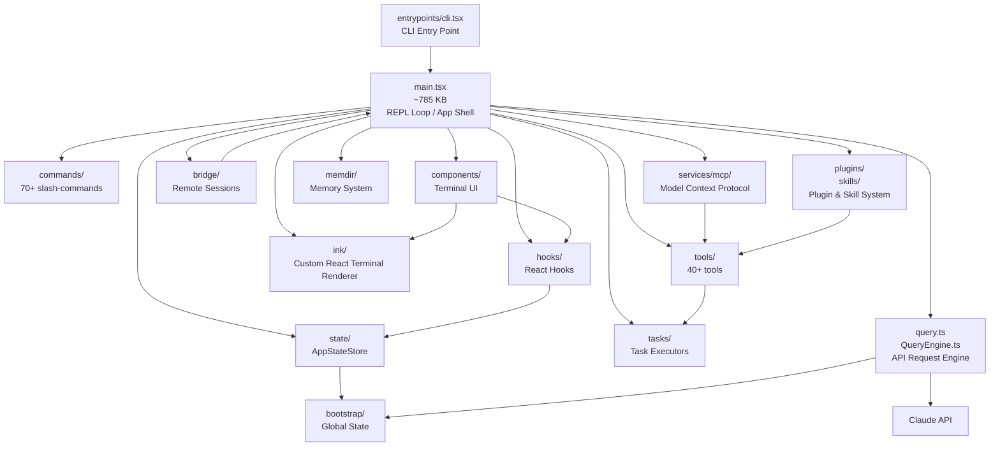

# Claude Code — Полная структура проекта

> Утёкший исходный код Claude Code (через sourcemap в npm-пакете).
> Описание каждого файла и директории.

---

## Корневые файлы

| Файл | Назначение |
|---|---|
| `main.tsx` | **Главная точка входа** (~785 КБ). Инициализирует CLI, рендерит React-дерево терминала, управляет жизненным циклом сессии. Крупнейший файл проекта. |
| `commands.ts` | **Реестр всех slash-команд**. Импортирует и регистрирует все команды из `commands/`, экспортирует их для main.tsx. |
| `QueryEngine.ts` | **Движок выполнения запросов к Claude API**. Управляет потоком сообщений, ретраями, подсчётом использования, обработкой ошибок. |
| `Task.ts` | **Базовые типы задач**: `TaskType` (local_bash, local_agent, remote_agent, in_process_teammate, local_workflow, monitor_mcp, dream), `TaskStatus`, `TaskHandle`, `TaskContext`. |
| `Tool.ts` | **Базовые типы инструментов**: `ToolInputJSONSchema`, импорты для tool-системы. Центральный хаб для регистрации инструментов. |
| `tools.ts` | **Экспорт всех тулов**: точка сбора всех инструментов, доступных агенту. |
| `tasks.ts` | **Менеджер задач**: управление жизненным циклом задач (создание, запуск, остановка, очистка). |
| `query.ts` | **Функция запроса к Claude**: основная логика отправки сообщений и обработки ответов от API. |
| `setup.ts` | **Инициализация окружения**: настройка переменных, проверка зависимостей при старте. |
| `ink.ts` | **Точка входа Ink-рендерера**: подключение кастомного React-рендерера для терминала. |
| `cost-tracker.ts` | **Трекер стоимости API-вызовов**: подсчёт токенов, длительности, общей стоимости. |
| `costHook.ts` | **Хук для трекинга стоимости на уровне хуков**. |
| `history.ts` | **История сессий**: сохранение и загрузка истории разговоров. |
| `interactiveHelpers.tsx` | **Вспомогательные функции для интерактивного режима**: хелперы для UI терминала. |
| `dialogLaunchers.tsx` | **Запуск диалогов**: модальные окна и диалоги (разрешения, подтверждения). |
| `context.ts` | **Контекст сессии**: управление контекстом, который отправляется модели. |
| `replLauncher.tsx` | **Запуск REPL-режима**: интерактивный режим «читай-оценивай-печатай». |
| `projectOnboardingState.ts` | **Состояние онбординга проекта**: отслеживание первого запуска, обучение. |
| `README.md` | Описание утечки на английском. |
| `README_RU.md` | Описание утечки на русском. |
| `STRUCTURE.md` | Этот файл. |

---

## `state/` — Состояние приложения

| Файл | Назначение |
|---|---|
| `AppStateStore.ts` | **Хранилище состояния (Zustand-like)**: полное состояние приложения — сообщения, задачи, инструменты, разрешения, настройки. |
| `AppState.tsx` | **React-провайдер состояния**: оборачивает дерево в `AppStateProvider`, управляет `BypassPermissionsMode`. |
| `store.ts` | **Создание стора**: фабрика `createStore()` для `AppStateStore`. |
| `selectors.ts` | **Селекторы состояния**: функции для извлечения частей состояния. |
| `onChangeAppState.ts` | **Подписка на изменения состояния**: колбэки при мутациях стора. |
| `teammateViewHelpers.ts` | **Хелперы для просмотра тиммейтов**: функции для UI отображения агентов-коллег. |

---

## `assistant/` — Ассистент и история

| Файл | Назначение |
|---|---|
| `sessionHistory.ts` | **История сессий ассистента**: управление историей разговоров, загрузка/сохранение. |

---

## `bootstrap/` — Загрузка и глобальное состояние

| Файл | Назначение |
|---|---|
| `state.ts` | **Глобальное состояние загрузки**: `originalCwd`, `projectRoot`, счётчики (стоимость, токены, длительность), управление feature-флагами, хуки, каналы. Около 200+ полей. |

---

## `bridge/` — Мост для удалённых сессий

Система, позволяющая подключаться к Claude Code удалённо (через IDE, браузер, мобильное приложение).

| Файл | Назначение |
|---|---|
| `types.ts` | Типы для бриджа. |
| `bridgeMain.ts` | Главный модуль бриджа. |
| `bridgeApi.ts` | API для взаимодействия с бриджем. |
| `bridgeConfig.ts` | Конфигурация бриджа. |
| `bridgeDebug.ts` | Отладка бриджа. |
| `bridgeEnabled.ts` | Проверка, включён ли бридж. |
| `bridgeMessaging.ts` | Обмен сообщениями через бридж. |
| `bridgePermissionCallbacks.ts` | Колбэки разрешений для удалённых сессий. |
| `bridgePointer.ts` | Управление «курсором» в удалённой сессии. |
| `bridgeStatusUtil.ts` | Утилиты статуса бриджа. |
| `bridgeUI.ts` | UI-компоненты бриджа. |
| `capacityWake.ts` | Пробуждение спящей сессии. |
| `codeSessionApi.ts` | API для кодовых сессий (прямое подключение IDE). |
| `createSession.ts` | Создание удалённой сессии. |
| `debugUtils.ts` | Отладочные утилиты. |
| `envLessBridgeConfig.ts` | Конфигурация бриджа без переменных окружения. |
| `flushGate.ts` | Контроль очереди отправки сообщений. |
| `inboundAttachments.ts` | Обработка входящих вложений. |
| `inboundMessages.ts` | Обработка входящих сообщений. |
| `initReplBridge.ts` | Инициализация REPL-бриджа. |
| `jwtUtils.ts` | Утилиты JWT-токенов. |
| `pollConfig.ts` | Конфигурация поллинга. |
| `pollConfigDefaults.ts` | Значения по умолчанию для поллинга. |
| `remoteBridgeCore.ts` | Ядро удалённого бриджа. |
| `replBridge.ts` | REPL-бридж (CLI режим). |
| `replBridgeHandle.ts` | Обработчик REPL-бриджа. |
| `replBridgeTransport.ts` | Транспорт для REPL-бриджа. |
| `sessionIdCompat.ts` | Совместимость ID сессий. |
| `sessionRunner.ts` | Запуск сессии через бридж. |
| `trustedDevice.ts` | Управление доверенными устройствами. |
| `workSecret.ts` | Секрет рабочего окружения. |

---

## `buddy/` — «Buddy» (компаньон)

Система спрайтов-компаньонов в терминале.

| Файл | Назначение |
|---|---|
| `companion.ts` | Логика компаньона. |
| `CompanionSprite.tsx` | Компонент отрисовки спрайта. |
| `prompt.ts` | Промпты для компаньона. |
| `sprites.ts` | Данные спрайтов (анимации). |
| `types.ts` | Типы компаньона. |
| `useBuddyNotification.tsx` | Хук уведомлений от компаньона. |

---

## `cli/` — CLI-интерфейс

| Файл | Назначение |
|---|---|
| `exit.ts` | Корректный выход из CLI. |
| `print.ts` | Функции вывода в терминал. |
| `remoteIO.ts` | Удалённый ввод/вывод. |
| `structuredIO.ts` | Структурированный ввод/вывод (JSON). |
| `ndjsonSafeStringify.ts` | Безопасная сериализация в NDJSON. |
| `update.ts` | Обновление CLI. |
| **`handlers/`** | |
| `handlers/agents.ts` | Обработчик CLI-команд для агентов. |
| `handlers/auth.ts` | Обработчик аутентификации. |
| `handlers/autoMode.ts` | Обработчик авто-режима. |
| `handlers/mcp.tsx` | Обработчик MCP. |
| `handlers/plugins.ts` | Обработчик плагинов. |
| `handlers/util.tsx` | Утилиты обработчиков. |
| **`transports/`** | |
| `transports/ccrClient.ts` | Клиент CCR (Claude Code Remote). |
| `transports/HybridTransport.ts` | Гибридный транспорт (SSE + WebSocket). |
| `transports/SSETransport.ts` | Server-Sent Events транспорт. |
| `transports/WebSocketTransport.ts` | WebSocket транспорт. |
| `transports/SerialBatchEventUploader.ts` | Пакетная загрузка событий. |
| `transports/WorkerStateUploader.ts` | Загрузка состояния воркера. |
| `transports/transportUtils.ts` | Утилиты транспорта. |

---

## `commands/` — Slash-команды

Каждая поддиректория — одна команда. Регистрируются в `commands.ts`.

| Команда | Назначение |
|---|---|
| `add-dir/` | `/add-dir` — добавить директорию в рабочее пространство. |
| `agents/` | `/agents` — управление агентами. |
| `ant-trace/` | `/ant-trace` — отладка ANT (внутренний инструмент Anthropic). |
| `autofix-pr/` | `/autofix-pr` — автоматическое исправление PR. |
| `backfill-sessions/` | `/backfill-sessions` — заполнение истории сессий. |
| `branch/` | `/branch` — работа с git-ветками. |
| `break-cache/` | `/break-cache` — сброс кеша. |
| `bridge/` | `/bridge` — управление бриджем. |
| `bridge-kick.ts` | `/bridge-kick` — отключение клиента бриджа. |
| `brief.ts` | `/brief` — краткий вывод. |
| `btw/` | `/btw` — фоновая задача. |
| `bughunter/` | `/bughunter` — поиск багов. |
| `chrome/` | `/chrome` — интеграция с Chrome. |
| `clear/` | `/clear` — очистка кешей, разговора. |
| `color/` | `/color` — настройка цветов. |
| `commit.ts` | `/commit` — создание коммита. |
| `commit-push-pr.ts` | `/commit-push-pr` — коммит + push + PR. |
| `compact/` | `/compact` — сжатие контекста. |
| `config/` | `/config` — настройки. |
| `context/` | `/context` — показать/управлять контекстом. |
| `copy/` | `/copy` — копирование. |
| `cost/` | `/cost` — показать стоимость. |
| `ctx_viz/` | `/ctx-viz` — визуализация контекста. |
| `debug-tool-call/` | `/debug-tool-call` — отладка вызовов инструментов. |
| `desktop/` | `/desktop` — десктоп-интеграция. |
| `diff/` | `/diff` — показать diff. |
| `doctor/` | `/doctor` — диагностика проблем. |
| `effort/` | `/effort` — оценка усилий. |
| `env/` | `/env` — переменные окружения. |
| `exit/` | `/exit` — выход. |
| `export/` | `/export` — экспорт разговора. |
| `extra-usage/` | `/extra-usage` — расширенная статистика использования. |
| `fast/` | `/fast` — быстрый режим. |
| `feedback/` | `/feedback` — обратная связь. |
| `files/` | `/files` — управление файлами. |
| `good-claude/` | `/good-claude` — (внутреннее). |
| `heapdump/` | `/heapdump` — дамп кучи. |
| `help/` | `/help` — справка. |
| `hooks/` | `/hooks` — управление хуками. |
| `ide/` | `/ide` — интеграция с IDE. |
| `init.ts` | `/init` — инициализация проекта. |
| `init-verifiers.ts` | `/init-verifiers` — инициализация верификаторов. |
| `insights.ts` | `/insights` — аналитика. |
| `install-github-app/` | `/install-github-app` — установка GitHub App. |
| `install-slack-app/` | `/install-slack-app` — установка Slack App. |
| `issue/` | `/issue` — создание issue. |
| `keybindings/` | `/keybindings` — настройка клавиш. |
| `login/` | `/login` — вход. |
| `logout/` | `/logout` — выход. |
| `mcp/` | `/mcp` — управление MCP-серверами. |
| `memory/` | `/memory` — управление памятью. |
| `mobile/` | `/mobile` — мобильное приложение. |
| `mock-limits/` | `/mock-limits` — тестовые лимиты. |
| `model/` | `/model` — выбор модели. |
| `oauth-refresh/` | `/oauth-refresh` — обновление OAuth. |
| `onboarding/` | `/onboarding` — онбординг. |
| `output-style/` | `/output-style` — стиль вывода. |
| `passes/` | `/passes` — несколько проходов. |
| `perf-issue/` | `/perf-issue` — баг-репорт производительности. |
| `permissions/` | `/permissions` — управление разрешениями. |
| `plan/` | `/plan` — режим планирования. |
| `plugin/` | `/plugin` — управление плагинами (маркетплейс, установка, настройки). |
| `pr_comments/` | `/pr-comments` — комментарии PR. |
| `privacy-settings/` | `/privacy-settings` — настройки приватности. |
| `rate-limit-options/` | `/rate-limit-options` — опции ограничения частоты. |
| `release-notes/` | `/release-notes` — заметки о релизе. |
| `reload-plugins/` | `/reload-plugins` — перезагрузка плагинов. |
| `remote-env/` | `/remote-env` — удалённое окружение. |
| `remote-setup/` | `/remote-setup` — настройка удалённой сессии. |
| `rename/` | `/rename` — переименование сессии. |
| `reset-limits/` | `/reset-limits` — сброс лимитов. |
| `resume/` | `/resume` — возобновление сессии. |
| `review/` | `/review` — код-ревью. |
| `review.ts` | `/review` — альтернативная реализация. |
| `rewind/` | `/rewind` — откат. |
| `sandbox-toggle/` | `/sandbox-toggle` — переключение песочницы. |
| `security-review.ts` | `/security-review` — проверка безопасности. |
| `session/` | `/session` — управление сессией. |
| `share/` | `/share` — поделиться. |
| `skills/` | `/skills` — управление навыками. |
| `stats/` | `/stats` — статистика. |
| `status/` | `/status` — статус. |
| `statusline.tsx` | `/statusline` — строка статуса. |
| `stickers/` | `/stickers` — стикеры. |
| `summary/` | `/summary` — сводка. |
| `tag/` | `/tag` — теги. |
| `tasks/` | `/tasks` — управление задачами. |
| `teleport/` | `/teleport` — телепортация сессии. |
| `terminalSetup/` | `/terminal-setup` — настройка терминала. |
| `theme/` | `/theme` — тема оформления. |
| `thinkback/` | `/thinkback` — ретроспектива. |
| `thinkback-play/` | `/thinkback-play` — проигрывание ретроспективы. |
| `ultraplan.tsx` | `/ultraplan` — продвинутый план. |
| `upgrade/` | `/upgrade` — обновление. |
| `usage/` | `/usage` — использование. |
| `version.ts` | `/version` — версия. |
| `vim/` | `/vim` — Vim-режим. |
| `voice/` | `/voice` — голосовой ввод. |
| `createMovedToPluginCommand.ts` | Утилита для миграции команд в плагины. |

---

## `components/` — React-компоненты терминального UI

### Верхний уровень

| Файл | Назначение |
|---|---|
| `App.tsx` | **Корневой компонент**: оборачивает дерево в `AppStateProvider`, `StatsProvider`, `FpsMetricsProvider`. |
| `FullscreenLayout.tsx` | Полноэкранный лейаут. |
| `BaseTextInput.tsx` | Базовый ввод текста. |
| `BashModeProgress.tsx` | Прогресс выполнения bash-команд. |
| `CompactSummary.tsx` | Компактная сводка. |
| `ContextSuggestions.tsx` | Подсказки по контексту. |
| `ContextVisualization.tsx` | Визуализация контекста. |
| `CoordinatorAgentStatus.tsx` | Статус координатора агентов. |
| `DevBar.tsx` | Панель разработчика. |
| `DiagnosticsDisplay.tsx` | Отображение диагностики. |
| `EffortCallout.tsx` | Индикатор усилий. |
| `EffortIndicator.ts` | Индикатор усилий (чистая логика). |
| `ExitFlow.tsx` | Процесс выхода. |
| `ExportDialog.tsx` | Диалог экспорта. |
| `FastIcon.tsx` | Иконка быстрого режима. |
| `Feedback.tsx` | Форма обратной связи. |
| `FilePathLink.tsx` | Ссылка на файл. |
| `FileEditToolDiff.tsx` | Отображение diff FileEdit. |
| `FileEditToolUpdatedMessage.tsx` | Сообщение об обновлении через FileEdit. |
| `FileEditToolUseRejectedMessage.tsx` | Сообщение об отказе FileEdit. |
| `HighlightedCode.tsx` | Подсветка кода. |
| `HistorySearchDialog.tsx` | Поиск по истории. |
| `GlobalSearchDialog.tsx` | Глобальный поиск. |
| `IdeStatusIndicator.tsx` | Индикатор статуса IDE. |
| `IdleReturnDialog.tsx` | Диалог возврата из idle. |
| `InterruptedByUser.tsx` | Сообщение о прерывании пользователем. |
| `KeybindingWarnings.tsx` | Предупреждения о конфликтах клавиш. |
| `LanguagePicker.tsx` | Выбор языка. |
| `LogSelector.tsx` | Выбор лога. |
| `AutoUpdater.tsx` | Автообновление. |
| `AutoUpdaterWrapper.tsx` | Обёртка автообновления. |
| `BypassPermissionsModeDialog.tsx` | Диалог bypass permissions. |
| `AutoModeOptInDialog.tsx` | Диалог включения авто-режима. |
| `BridgeDialog.tsx` | Диалог бриджа. |
| `ConsoleOAuthFlow.tsx` | OAuth-поток в консоли. |
| `CostThresholdDialog.tsx` | Диалог лимита стоимости. |
| `CtrlOToExpand.tsx` | Подсказка Ctrl+O для раскрытия. |
| `DesktopHandoff.tsx` | Передача на десктоп. |
| `DevChannelsDialog.tsx` | Диалог dev-каналов. |
| `ChannelDowngradeDialog.tsx` | Диалог понижения канала. |
| `ClaudeInChromeOnboarding.tsx` | Онбординг Claude в Chrome. |
| `ClaudeMdExternalIncludesDialog.tsx` | Диалог внешних включений CLAUDE.md. |
| `ClickableImageRef.tsx` | Кликабельная ссылка на изображение. |
| `ConfigurableShortcutHint.tsx` | Подсказка настраиваемых клавиш. |
| `AwsAuthStatusBox.tsx` | Статус AWS-аутентификации. |
| `ApproveApiKey.tsx` | Подтверждение API-ключа. |
| `InvalidConfigDialog.tsx` | Диалог невалидного конфига. |
| `InvalidSettingsDialog.tsx` | Диалог невалидных настроек. |
| `IdeAutoConnectDialog.tsx` | Диалог автоподключения IDE. |
| `IdeOnboardingDialog.tsx` | Онбординг IDE. |
| `FallbackToolUseErrorMessage.tsx` | Ошибка fallback-инструмента. |
| `FallbackToolUseRejectedMessage.tsx` | Отказ fallback-инструмента. |

### Поддиректории компонентов

#### `components/agents/` — Управление агентами

| Файл | Назначение |
|---|---|
| `AgentsList.tsx` | Список агентов. |
| `AgentsMenu.tsx` | Меню агентов. |
| `AgentDetail.tsx` | Детали агента. |
| `AgentEditor.tsx` | Редактор агента. |
| `agentFileUtils.ts` | Утилиты файлов агента. |
| `AgentNavigationFooter.tsx` | Навигация агента. |
| `ColorPicker.tsx` | Выбор цвета агента. |
| `generateAgent.ts` | Генерация агента. |
| `ModelSelector.tsx` | Выбор модели для агента. |
| `ToolSelector.tsx` | Выбор инструментов агента. |
| `types.ts` | Типы агентов. |
| `utils.ts` | Утилиты агентов. |
| `validateAgent.ts` | Валидация агента. |
| **`new-agent-creation/`** | Мастер создания агента |
| `CreateAgentWizard.tsx` | Сам мастер. |
| `wizard-steps/ColorStep.tsx` | Шаг: цвет. |
| `wizard-steps/ConfirmStep.tsx` | Шаг: подтверждение. |
| `wizard-steps/DescriptionStep.tsx` | Шаг: описание. |
| `wizard-steps/GenerateStep.tsx` | Шаг: генерация. |
| `wizard-steps/LocationStep.tsx` | Шаг: расположение. |
| `wizard-steps/MemoryStep.tsx` | Шаг: память. |
| `wizard-steps/MethodStep.tsx` | Шаг: метод. |
| `wizard-steps/ModelStep.tsx` | Шаг: модель. |
| `wizard-steps/PromptStep.tsx` | Шаг: промпт. |
| `wizard-steps/ToolsStep.tsx` | Шаг: инструменты. |
| `wizard-steps/TypeStep.tsx` | Шаг: тип. |

#### `components/design-system/` — Дизайн-система

| Файл | Назначение |
|---|---|
| `Byline.tsx` | Подпись/авторство. |
| `color.ts` | Цветовая палитра. |
| `Dialog.tsx` | Диалоговое окно. |
| `Divider.tsx` | Разделитель. |
| `FuzzyPicker.tsx` | Нечёткий выбор. |
| `KeyboardShortcutHint.tsx` | Подсказка клавиш. |
| `ListItem.tsx` | Элемент списка. |
| `LoadingState.tsx` | Состояние загрузки. |
| `Pane.tsx` | Панель. |
| `ProgressBar.tsx` | Прогресс-бар. |
| `Ratchet.tsx` | Храповик (необратимый переход). |
| `StatusIcon.tsx` | Иконка статуса. |
| `Tabs.tsx` | Вкладки. |
| `ThemedBox.tsx` | Тематический контейнер. |
| `ThemedText.tsx` | Тематический текст. |
| `ThemeProvider.tsx` | Провайдер темы. |

#### `components/diff/` — Отображение diff

| Файл | Назначение |
|---|---|
| `DiffDialog.tsx` | Диалог diff. |
| `DiffDetailView.tsx` | Детальный просмотр diff. |
| `DiffFileList.tsx` | Список файлов diff. |

#### `components/FeedbackSurvey/` — Опросы обратной связи

| Файл | Назначение |
|---|---|
| `FeedbackSurvey.tsx` | Компонент опроса. |
| `FeedbackSurveyView.tsx` | Вид опроса. |
| `submitTranscriptShare.ts` | Отправка транскрипта. |
| `TranscriptSharePrompt.tsx` | Запрос на шаринг транскрипта. |
| `useDebouncedDigitInput.ts` | Debounced ввод цифр. |
| `useFeedbackSurvey.tsx` | Хук опроса. |
| `useMemorySurvey.tsx` | Хук опроса памяти. |
| `usePostCompactSurvey.tsx` | Хук опроса после сжатия. |
| `useSurveyState.tsx` | Состояние опроса. |

#### `components/grove/` — Grove (визуализация)

| Файл | Назначение |
|---|---|
| `Grove.tsx` | Компонент визуализации Grove. |

#### `components/HelpV2/` — Справка v2

| Файл | Назначение |
|---|---|
| `HelpV2.tsx` | Основной компонент справки. |
| `Commands.tsx` | Команды в справке. |
| `General.tsx` | Общая информация. |

#### `components/HighlightedCode/` — Подсветка кода

| Файл | Назначение |
|---|---|
| `Fallback.tsx` | Fallback-подсветка (без Shiki). |

#### `components/hooks/` — UI хуков

| Файл | Назначение |
|---|---|
| `HooksConfigMenu.tsx` | Меню настройки хуков. |
| `PromptDialog.tsx` | Диалог промпта хука. |
| `SelectEventMode.tsx` | Выбор режима события. |
| `SelectHookMode.tsx` | Выбор режима хука. |
| `SelectMatcherMode.tsx` | Выбор режима совпадения. |
| `ViewHookMode.tsx` | Просмотр хука. |

#### `components/LogoV2/` — Логотип и уведомления

| Файл | Назначение |
|---|---|
| `LogoV2.tsx` | Логотип v2. |
| `Clawd.tsx` | Clawd (персонаж). |
| `AnimatedAsterisk.tsx` | Анимированная звёздочка. |
| `AnimatedClawd.tsx` | Анимированный Clawd. |
| `ChannelsNotice.tsx` | Уведомление о каналах. |
| `CondensedLogo.tsx` | Компактный логотип. |
| `EmergencyTip.tsx` | Экстренный совет. |
| `Feed.tsx` | Лента. |
| `FeedColumn.tsx` | Колонка ленты. |
| `feedConfigs.tsx` | Конфигурации ленты. |
| `GuestPassesUpsell.tsx` | Апселл гостевых пропусков. |
| `Opus1mMergeNotice.tsx` | Уведомление об Opus 1M. |
| `OverageCreditUpsell.tsx` | Апселл кредитов. |
| `VoiceModeNotice.tsx` | Уведомление голосового режима. |
| `WelcomeV2.tsx` | Приветствие v2. |

#### `components/mcp/` — MCP UI

| Файл | Назначение |
|---|---|
| `utils/` | Утилиты MCP UI. |

#### `components/memory/` — UI памяти

#### `components/messages/` — Сообщения

| Файл | Назначение |
|---|---|
| `UserToolResultMessage/` | Результат инструмента пользователя. |

#### `components/permissions/` — Запросы разрешений

| Файл | Назначение |
|---|---|
| `AskUserQuestionPermissionRequest/` | Запрос вопроса пользователю. |
| `BashPermissionRequest/` | Запрос bash. |
| `ComputerUseApproval/` | Подтверждение Computer Use. |
| `EnterPlanModePermissionRequest/` | Запрос входа в режим плана. |
| `ExitPlanModePermissionRequest/` | Запрос выхода из режима плана. |
| `FileEditPermissionRequest/` | Запрос редактирования файла. |
| `FilePermissionDialog/` | Диалог файловых разрешений. |
| `FilesystemPermissionRequest/` | Запрос доступа к ФС. |
| `FileWritePermissionRequest/` | Запрос записи файла. |
| `NotebookEditPermissionRequest/` | Запрос редактирования ноутбука. |
| `PowerShellPermissionRequest/` | Запрос PowerShell. |
| `SedEditPermissionRequest/` | Запрос sed-редактирования. |
| `SkillPermissionRequest/` | Запрос навыка. |
| `WebFetchPermissionRequest/` | Запрос веб-запроса. |
| `rules/` | Правила разрешений. |

#### `components/PromptInput/` — Ввод промпта

#### `components/sandbox/` — Песочница

#### `components/Settings/` — Настройки

#### `components/shell/` — Оболочка

#### `components/skills/` — Навыки (UI)

#### `components/Spinner/` — Спиннер

#### `components/StructuredDiff/` — Структурированный diff

#### `components/tasks/` — Задачи (UI)

#### `components/teams/` — Команды

#### `components/TrustDialog/` — Диалог доверия

#### `components/ui/` — UI-кит

#### `components/wizard/` — Мастер

#### `components/ClaudeCodeHint/` — Подсказки Claude Code

| `PluginHintMenu.tsx` | Меню подсказок плагинов. |

#### `components/CustomSelect/` — Кастомный Select

| Файл | Назначение |
|---|---|
| `index.ts` | Точка входа. |
| `option-map.ts` | Карта опций. |
| `select.tsx` | Компонент Select. |
| `select-input-option.tsx` | Опция ввода. |
| `SelectMulti.tsx` | Мультивыбор. |
| `select-option.tsx` | Опция выбора. |
| `use-multi-select-state.ts` | Состояние мультивыбора. |
| `use-select-input.ts` | Ввод выбора. |
| `use-select-navigation.ts` | Навигация выбора. |
| `use-select-state.ts` | Состояние выбора. |

#### `components/DesktopUpsell/` — Апселл десктопа

| `DesktopUpsellStartup.tsx` | Апселл при запуске. |

#### `components/LspRecommendation/` — Рекомендации LSP

| `LspRecommendationMenu.tsx` | Меню рекомендаций LSP. |

#### `components/ManagedSettingsSecurityDialog/` — Безопасность управляемых настроек

#### `components/Passes/` — Проходы

---

## `ink/` — Кастомный React-рендерер для терминала

Ink — это самописный React-реконсилер для рендеринга в ANSI-терминале (альтернатива библиотеке `ink`).

| Файл | Назначение |
|---|---|
| `ink.tsx` | **Главный файл рендерера** (~252 КБ): ядро, компонент `Box`, `Text`, `Static`. |
| `reconciler.ts` | React-реконсилер для терминала. |
| `renderer.ts` | Рендерер вывода. |
| `render-node-to-output.ts` | Преобразование React-нод в ANSI-вывод (~63 КБ). |
| `render-to-screen.ts` | Рендеринг на экран. |
| `output.ts` | Управление выводом (~26 КБ). |
| `screen.ts` | Экранный буфер (~49 КБ). |
| `dom.ts` | DOM-абстракция для терминала. |
| `styles.ts` | Стилизация (~21 КБ). |
| `root.ts` | Корневой узел. |
| `Ansi.tsx` | Компонент для ANSI-escape последовательностей. |
| `bidi.ts` | Поддержка двунаправленного текста. |
| `clearTerminal.ts` | Очистка терминала. |
| `colorize.ts` | Раскраска текста. |
| `constants.ts` | Константы. |
| `focus.ts` | Управление фокусом. |
| `frame.ts` | Управление кадрами. |
| `get-max-width.ts` | Максимальная ширина. |
| `hit-test.ts` | Тест попадания. |
| `instances.ts` | Экземпляры. |
| `line-width-cache.ts` | Кеш ширины строк. |
| `log-update.ts` | Обновление лога (~27 КБ). |
| `measure-element.ts` | Измерение элемента. |
| `measure-text.ts` | Измерение текста. |
| `node-cache.ts` | Кеш нод. |
| `optimizer.ts` | Оптимизатор рендеринга. |
| `parse-keypress.ts` | Парсинг нажатий клавиш (~23 КБ). |
| `render-border.ts` | Рендеринг границ. |
| `searchHighlight.ts` | Подсветка поиска. |
| `selection.ts` | Выделение текста (~35 КБ). |
| `squash-text-nodes.ts` | Объединение текстовых нод. |
| `stringWidth.ts` | Ширина строки с учетом wide-символов. |
| `supports-hyperlinks.ts` | Поддержка гиперссылок. |
| `tabstops.ts` | Табуляция. |
| `terminal.ts` | Терминал. |
| `terminal-focus-state.ts` | Состояние фокуса терминала. |
| `terminal-querier.ts` | Запросы к терминалу. |
| `warn.ts` | Предупреждения. |
| `widest-line.ts` | Самая широкая строка. |
| `wrapAnsi.ts` | Обёртка ANSI. |
| `wrap-text.ts` | Перенос текста. |
| **`ink/components/`** | Встроенные Ink-компоненты. |
| **`ink/events/`** | Система событий. |
| **`ink/hooks/`** | Ink-хуки (`useInput`, `useStdout` и т.д.). |
| **`ink/layout/`** | Система раскладки (Yoga layout). |
| **`ink/termio/`** | Ввод/вывод терминала. |

---

## `tools/` — Инструменты (Tool system)

40+ инструментов, доступных агенту Claude Code для взаимодействия с системой.

| Инструмент | Назначение |
|---|---|
| `AgentTool/` | **Запуск под-агента** — делегирование задач другим агентам. Включает `built-in/` с предопределёнными агентами (exploreAgent и др.). |
| `AskUserQuestionTool/` | Запрос вопроса пользователю. |
| `BashTool/` | Выполнение bash-команд. |
| `BriefTool/` | Создание краткого вывода. |
| `ConfigTool/` | Чтение/запись конфигурации. |
| `EnterPlanModeTool/` | Вход в режим планирования. |
| `EnterWorktreeTool/` | Вход в worktree. |
| `ExitPlanModeTool/` | Выход из режима планирования. |
| `ExitWorktreeTool/` | Выход из worktree. |
| `FileEditTool/` | Редактирование файлов. |
| `FileReadTool/` | Чтение файлов. |
| `FileWriteTool/` | Запись файлов. |
| `GlobTool/` | Поиск файлов по glob-паттерну. |
| `GrepTool/` | Поиск по содержимому (регулярные выражения). |
| `ListMcpResourcesTool/` | Список MCP-ресурсов. |
| `LSPTool/` | Взаимодействие с Language Server Protocol. |
| `McpAuthTool/` | Аутентификация MCP. |
| `MCPTool/` | Вызов MCP-инструментов. |
| `NotebookEditTool/` | Редактирование Jupyter-ноутбуков. |
| `PowerShellTool/` | Выполнение PowerShell. |
| `ReadMcpResourceTool/` | Чтение MCP-ресурса. |
| `RemoteTriggerTool/` | Удалённый триггер. |
| `REPLTool/` | REPL-режим. |
| `ScheduleCronTool/` | Планирование cron-задач. |
| `SendMessageTool/` | Отправка сообщения. |
| `SkillTool/` | Вызов навыка (skill). |
| `SleepTool/` | Ожидание (sleep). |
| `SyntheticOutputTool/` | Синтетический вывод. |
| `TaskCreateTool/` | Создание задачи. |
| `TaskGetTool/` | Получение задачи. |
| `TaskListTool/` | Список задач. |
| `TaskOutputTool/` | Вывод задачи. |
| `TaskStopTool/` | Остановка задачи. |
| `TaskUpdateTool/` | Обновление задачи. |
| `TeamCreateTool/` | Создание команды. |
| `TeamDeleteTool/` | Удаление команды. |
| `TodoWriteTool/` | Запись TODO. |
| `ToolSearchTool/` | Поиск инструментов. |
| `WebFetchTool/` | HTTP-запросы (fetch). |
| `WebSearchTool/` | Веб-поиск. |
| `shared/` | Общие утилиты для инструментов. |
| `testing/` | Тестовые утилиты. |

---

## `tasks/` — Реализации типов задач

| Файл | Назначение |
|---|---|
| `DreamTask/` | **Фоновая консолидация памяти** («dream») — асинхронная обработка опыта. |
| `InProcessTeammateTask/` | Тиммейт в том же процессе. |
| `LocalAgentTask/` | Локальный агент (подпроцесс). |
| `LocalShellTask/` | Локальная shell-задача. |
| `RemoteAgentTask/` | Удалённый агент. |

---

## `services/` — Сервисы

| Сервис | Назначение |
|---|---|
| `AgentSummary/` | Суммаризация действий агента. |
| `analytics/` | Аналитика (GrowthBook, Statsig, OpenTelemetry). |
| `api/` | API-клиенты (Claude API, errors, logging). |
| `autoDream/` | Автоматический «dream» (фоновая обработка). |
| `compact/` | Сжатие контекста. |
| `extractMemories/` | Извлечение воспоминаний из разговоров. |
| `lsp/` | Language Server Protocol интеграция. |
| `MagicDocs/` | «Магическая» генерация документации. |
| `mcp/` | Model Context Protocol — интеграция MCP-серверов. |
| `oauth/` | OAuth-аутентификация. |
| `plugins/` | Система плагинов. |
| `policyLimits/` | Лимиты политик. |
| `PromptSuggestion/` | Подсказки промптов. |
| `remoteManagedSettings/` | Удалённые управляемые настройки. |
| `SessionMemory/` | Память сессии. |
| `settingsSync/` | Синхронизация настроек. |
| `teamMemorySync/` | Синхронизация командной памяти. |
| `tips/` | Советы/подсказки. |
| `tools/` | Сервисная логика инструментов. |
| `toolUseSummary/` | Суммаризация использования инструментов. |

---

## `hooks/` — React-хуки

| Файл | Описание |
|---|---|
| `useReplBridge.tsx` | **Основной хук REPL** (~115 КБ) — управление жизненным циклом REPL-сессии. |
| `useTypeahead.tsx` | **Автодополнение** (~213 КБ) — крупнейший хук, файловая система, команды, пути. |
| `useVoiceIntegration.tsx` | Голосовая интеграция (~99 КБ). |
| `useVoice.ts` | Голосовой ввод (~46 КБ). |
| `useVirtualScroll.ts` | Виртуальный скролл (~35 КБ). |
| `useCanUseTool.tsx` | Проверка доступности инструмента (~40 КБ). |
| `useArrowKeyHistory.tsx` | Навигация стрелками по истории. |
| `useGlobalKeybindings.tsx` | Глобальные сочетания клавиш. |
| `useInboxPoller.ts` | Polling входящих сообщений. |
| `useHistorySearch.ts` | Поиск по истории. |
| `useCommandKeybindings.tsx` | Сочетания клавиш для команд. |
| `useSearchInput.ts` | Ввод поиска. |
| `useTextInput.ts` | Текстовый ввод. |
| `usePasteHandler.ts` | Обработка вставки. |
| `useCancelRequest.ts` | Отмена запроса. |
| `useTasksV2.ts` | Задачи v2. |
| `useManagePlugins.ts` | Управление плагинами. |
| `useIDEIntegration.tsx` | Интеграция с IDE. |
| `useLspPluginRecommendation.tsx` | Рекомендации LSP-плагинов. |
| `useClaudeCodeHintRecommendation.tsx` | Подсказки Claude Code. |
| `useRemoteSession.ts` | Удалённая сессия. |
| `useSSHSession.ts` | SSH-сессия. |
| `useBackgroundTaskNavigation.ts` | Навигация фоновых задач. |
| `useStreamingToolCalls.ts` | Стриминг вызовов инструментов. |
| `useDiffData.ts` | Данные diff. |
| `useDiffInIDE.ts` | Diff в IDE. |
| `useTurnDiffs.ts` | Diff за ход. |
| `useAssistantHistory.ts` | История ассистента. |
| `useAwaySummary.ts` | Сводка отсутствия. |
| `useSessionBackgrounding.ts` | Фоновый режим сессии. |
| `useDeferredHookMessages.ts` | Отложенные сообщения хуков. |
| `usePromptSuggestion.ts` | Подсказки промптов. |
| `usePromptsFromClaudeInChrome.tsx` | Промпты из Claude в Chrome. |
| `usePluginRecommendationBase.tsx` | Базовые рекомендации плагинов. |
| `useLogMessages.ts` | Лог-сообщения. |
| `useDirectConnect.ts` | Прямое подключение. |
| `useMergedTools.ts` | Объединённые инструменты. |
| `useMergedClients.ts` | Объединённые клиенты. |
| `useMergedCommands.ts` | Объединённые команды. |
| `useMemoryUsage.ts` | Использование памяти. |
| `useApiKeyVerification.ts` | Проверка API-ключа. |
| `useTeleportResume.tsx` | Возобновление через телепорт. |
| `usePrStatus.ts` | Статус PR. |
| `useScheduledTasks.ts` | Запланированные задачи. |
| `useSwarmPermissionPoller.ts` | Polling разрешений swarm. |
| `useSwarmInitialization.ts` | Инициализация swarm. |
| `useTaskListWatcher.ts` | Наблюдатель списка задач. |
| `useIssueFlagBanner.ts` | Баннер issue-флага. |
| `useSettings.ts` | Настройки. |
| `useSettingsChange.ts` | Изменение настроек. |
| `useDynamicConfig.ts` | Динамическая конфигурация. |
| `useSkillImprovementSurvey.ts` | Опрос улучшения навыков. |
| `useSkillsChange.ts` | Изменение навыков. |
| `useChromeExtensionNotification.tsx` | Уведомление расширения Chrome. |
| `useIdeAtMentioned.ts` | @-упоминания IDE. |
| `useIdeConnectionStatus.ts` | Статус подключения IDE. |
| `useIdeLogging.ts` | Логирование IDE. |
| `useIdeSelection.ts` | Выделение IDE. |
| `useUpdateNotification.ts` | Уведомление обновления. |
| `useFileHistorySnapshotInit.ts` | Снимок истории файлов. |
| `useInputBuffer.ts` | Буфер ввода. |
| `useClipboardImageHint.ts` | Подсказка изображения из буфера. |
| `useVimInput.ts` | Vim-ввод. |
| `useBlink.ts` | Мигание. |
| `useDoublePress.ts` | Двойное нажатие. |
| `useElapsedTime.ts` | Прошедшее время. |
| `useTimeout.ts` | Таймаут. |
| `useTerminalSize.ts` | Размер терминала. |
| `useAfterFirstRender.ts` | После первого рендера. |
| `useExitOnCtrlCD.ts` | Выход по Ctrl+C дважды. |
| `useExitOnCtrlCDWithKeybindings.ts` | Выход по Ctrl+C с клавишами. |
| `useQueueProcessor.ts` | Обработчик очереди. |
| `useCommandQueue.ts` | Очередь команд. |
| `useCopyOnSelect.ts` | Копирование при выделении. |
| `useMainLoopModel.ts` | Модель главного цикла. |
| `useVoiceEnabled.ts` | Доступность голоса. |
| `useMailboxBridge.ts` | Мост почтового ящика. |
| `useMinDisplayTime.ts` | Минимальное время отображения. |
| `useNotifyAfterTimeout.ts` | Уведомление после таймаута. |
| `useOfficialMarketplaceNotification.tsx` | Уведомление оф. маркетплейса. |
| `useTeammateViewAutoExit.ts` | Автовыход из просмотра тиммейта. |
| **`hooks/notifs/`** | Хуки уведомлений. |
| **`hooks/toolPermission/`** | Хуки разрешений инструментов. |
| `hooks/toolPermission/handlers/` | Обработчики разрешений. |
| `fileSuggestions.ts` | Подсказки файлов (~27 КБ). |
| `unifiedSuggestions.ts` | Унифицированные подсказки. |
| `renderPlaceholder.ts` | Placeholder рендеринга. |

---

## `context/` — Контекст (React Context)

| Файл | Назначение |
|---|---|
| `fpsMetrics.tsx` | FPS-метрики. |
| `mailbox.tsx` | Почтовый ящик сообщений. |
| `modalContext.tsx` | Контекст модальных окон. |
| `notifications.tsx` | Контекст уведомлений (~33 КБ). |
| `overlayContext.tsx` | Контекст оверлеев (~14 КБ). |
| `promptOverlayContext.tsx` | Контекст оверлея промпта. |
| `QueuedMessageContext.tsx` | Контекст очереди сообщений. |
| `stats.tsx` | Контекст статистики (~22 КБ). |
| `voice.tsx` | Контекст голоса. |

---

## `query/` — Система запросов к Claude

| Файл | Назначение |
|---|---|
| `config.ts` | Конфигурация запроса (сессия, feature-гейты). |
| `deps.ts` | Зависимости запроса. |
| `stopHooks.ts` | Хуки остановки (~17 КБ). |
| `tokenBudget.ts` | Бюджет токенов. |

---

## `coordinator/` — Режим координатора агентов

| Файл | Назначение |
|---|---|
| `coordinatorMode.ts` | Логика координатора (~19 КБ) — оркестрация нескольких агентов. |

---

## `memdir/` — Система памяти («memdir»)

| Файл | Назначение |
|---|---|
| `memdir.ts` | **Ядро системы памяти** (~21 КБ) — загрузка, сохранение, поиск воспоминаний. |
| `findRelevantMemories.ts` | Поиск релевантных воспоминаний. |
| `memoryAge.ts` | Возраст воспоминаний. |
| `memoryScan.ts` | Сканирование памяти. |
| `memoryTypes.ts` | Типы воспоминаний (~23 КБ). |
| `paths.ts` | Пути к файлам памяти (~11 КБ). |
| `teamMemPaths.ts` | Пути командной памяти (~12 КБ). |
| `teamMemPrompts.ts` | Промпты командной памяти. |

---

## `entrypoints/` — Точки входа

| Файл | Назначение |
|---|---|
| `cli.tsx` | **Точка входа CLI** (~39 КБ) — разбор аргументов, инициализация. |
| `init.ts` | Инициализация (~14 КБ). |
| `mcp.ts` | Точка входа MCP. |
| `agentSdkTypes.ts` | Типы SDK агента (~13 КБ). |
| `sandboxTypes.ts` | Типы песочницы. |
| `sdk/` | SDK-интеграция. |

---

## `types/` — Общие типы

| Файл | Назначение |
|---|---|
| `command.ts` | Типы команд. |
| `hooks.ts` | Типы хуков. |
| `ids.ts` | Типы идентификаторов (SessionId, AgentId и др.). |
| `logs.ts` | Типы логов (~11 КБ). |
| `permissions.ts` | Типы разрешений (~13 КБ). |
| `plugin.ts` | Типы плагинов (~11 КБ). |
| `textInputTypes.ts` | Типы текстового ввода (~12 КБ). |
| `generated/` | Сгенерированные типы (Protobuf, events_mono). |
| `generated/events_mono/claude_code/v1/` | События Claude Code v1. |
| `generated/events_mono/common/v1/` | Общие события v1. |
| `generated/events_mono/growthbook/v1/` | События GrowthBook v1. |
| `generated/google/protobuf/` | Google Protobuf-типы. |

---

## `constants/` — Константы

| Файл | Назначение |
|---|---|
| `prompts.ts` | **Системные промпты** (~54 КБ) — все промпты для Claude. |
| `apiLimits.ts` | Лимиты API. |
| `betas.ts` | Beta-фичи. |
| `common.ts` | Общие константы. |
| `cyberRiskInstruction.ts` | Инструкция по кибер-рискам. |
| `errorIds.ts` | ID ошибок. |
| `figures.ts` | Фигуры/иконки. |
| `files.ts` | Файловые константы. |
| `github-app.ts` | Константы GitHub App. |
| `keys.ts` | Ключи. |
| `messages.ts` | Константы сообщений. |
| `oauth.ts` | OAuth-константы. |
| `outputStyles.ts` | Стили вывода (~10 КБ). |
| `product.ts` | Продуктовые константы. |
| `spinnerVerbs.ts` | Глаголы для спиннера. |
| `system.ts` | Системные константы. |
| `systemPromptSections.ts` | Секции системного промпта. |
| `toolLimits.ts` | Лимиты инструментов. |
| `tools.ts` | Константы инструментов. |
| `turnCompletionVerbs.ts` | Глаголы завершения хода. |
| `xml.ts` | XML-теги. |

---

## `utils/` — Утилиты

Крупнейшая директория (~150+ файлов). Ключевые:

| Категория | Файлы |
|---|---|
| **Конфигурация** | `config.ts` (~63 КБ), `configConstants.ts`, `cliArgs.ts` |
| **Аутентификация** | `auth.ts` (~65 КБ), `authFileDescriptor.ts`, `authPortable.ts` |
| **Файлы и пути** | `cwd.ts`, `file.ts`, `fileHistory.ts`, `fileRead.ts`, `fsOperations.ts`, `glob.ts`, `detectRepository.ts` |
| **Git** | `git.ts` (~30 КБ), `gitDiff.ts`, `gitSettings.ts`, `commitAttribution.ts` |
| **IDE** | `ide.ts` (~47 КБ), `idePathConversion.ts`, `editor.ts`, `jetbrains.ts` |
| **CLI/терминал** | `ansiToPng.ts` (~215 КБ), `ansiToSvg.ts`, `asciicast.ts`, `Cursor.ts` (~47 КБ), `markdown.ts`, `frontmatterParser.ts` |
| **Изображения** | `imagePaste.ts`, `imageResizer.ts`, `imageStore.ts`, `imageValidation.ts` |
| **MCP** | `mcp/` (утлиты MCP) |
| **Память** | `memory/` |
| **Хуки** | `hooks.ts` (~159 КБ), `hooks/` |
| **Безопасность** | `permissions/`, `sandbox/` |
| **Плагины** | `plugins/` |
| **Swarm** | `swarm/`, `swarm/backends/` |
| **Сеть** | `api.ts`, `http.ts`, `apiPreconnect.ts` |
| **Bash** | `bash/`, `bash/specs/` |
| **PowerShell** | `powershell/` |
| **Shel** | `shell/` |
| **Настройки** | `settings/`, `settings/mdm/` |
| **Телеметрия** | `telemetry/` |
| **Навыки (Skills)** | `skills/` |
| **Задачи** | `task/` |
| **Фоновые задачи** | `background/`, `background/remote/` |
| **Хранилище** | `filePersistence/`, `secureStorage/` |
| **Клод в Chrome** | `claudeInChrome/` |
| **Deep link** | `deepLink/` |
| **Teleport** | `teleport/` |
| **Советы** | `suggestions/` |
| **DXT** | `dxt/` |
| **Computer Use** | `computerUse/` |
| **План** | `ultraplan/` |
| **Установка** | `nativeInstaller/`, `localInstaller.ts` |
| **Сообщения** | `messages/` |
| **Прочее** | `abortController.ts`, `activityManager.ts`, `agentContext.ts`, `agentSwarmEnabled.ts`, `analyzeContext.ts`, `array.ts`, `attachments.ts` (~127 КБ), `autoUpdater.ts`, `aws.ts`, `backgroundHousekeeping.ts`, `betas.ts`, `billing.ts`, `browser.ts`, `bufferedWriter.ts`, `bundledMode.ts`, `caCerts.ts`, `CircularBuffer.ts`, `classifierApprovals.ts`, `claudeCodeHints.ts`, `claudemd.ts` (~46 КБ), `cleanup.ts`, `codeIndexing.ts`, `collapseReadSearch.ts`, `combinedAbortSignal.ts`, `completionCache.ts`, `contentArray.ts`, `context.ts`, `contextAnalysis.ts`, `contextSuggestions.ts`, `conversationRecovery.ts`, `cron.ts`, `cronScheduler.ts`, `cronTasks.ts`, `debug.ts`, `debugFilter.ts`, `diff.ts`, `displayTags.ts`, `doctorContextWarnings.ts`, `doctorDiagnostic.ts`, `earlyInput.ts`, `effort.ts`, `embeddedTools.ts`, `env.ts`, `envUtils.ts`, `errorLogSink.ts`, `execFileNoThrow.ts`, `fastMode.ts`, `forkedAgent.ts`, `format.ts`, `fpsTracker.ts`, `fullscreen.ts`, `generators.ts`, `genericProcessUtils.ts`, `gracefulShutdown.ts`, `groupToolUses.ts`, `handlePromptSubmit.ts`, `headlessProfiler.ts`, `heapDumpService.ts`, `heatmap.ts`, `highlightMatch.tsx`, `horizontalScroll.ts`, `hyperlink.ts`, `idleTimeout.ts`, `inProcessTeammateHelpers.ts`, `intl.ts`, `json.ts`, `lazySchema.ts`, `listSessionsImpl.ts`, `lockfile.ts`, `log.ts`, `logoV2Utils.ts`, `mailbox.ts`, `managedEnv.ts`, `markdownConfigLoader.ts`, `parseArgs.ts`, `processUserInput/`, `shutdown.ts`, `structuredLog.ts`, `stylex.ts`, `theme.ts`, `thinking.ts`, `time.ts`, `toolDisplay.ts`, `toolErrorUtils.ts`, `toolNames.ts`, `toolTier.ts`, `turnTracking.ts`, `ultraplan/`, `undercoverMode.ts`, `userMessageHistory.ts`, `windowsTerminalBackup.ts`, `worktree.ts`, `zod.ts` |

---

## `plugins/` — Система плагинов

| Файл | Назначение |
|---|---|
| `builtinPlugins.ts` | Встроенные плагины. |
| `bundled/` | Встроенные (bundled) плагины. |

---

## `skills/` — Система навыков (Skills)

| Файл | Назначение |
|---|---|
| `bundled/` | Встроенные навыки. |

---

## `keybindings/` — Система сочетаний клавиш

---

## `outputStyles/` — Стили вывода

---

## `native-ts/` — Нативные TypeScript-модули

| Файл | Назначение |
|---|---|
| `color-diff/` | Подсветка diff. |
| `file-index/` | Индексация файлов. |
| `yoga-layout/` | Yoga layout engine (flexbox для терминала). |

---

## `migrations/` — Миграции

---

## `schemas/` — JSON-схемы

---

## `server/` — Серверная часть

---

## `screens/` — Экраны/страницы

---

## `vim/` — Vim-режим

---

## `voice/` — Голосовой режим

---

## `public/` — Публичные ресурсы

| Файл | Назначение |
|---|---|
| `claude-files.png` | Скриншот файлов Claude Code в npm. |
| `leak-tweet.png` | Скриншот твита об утечке. |

---

## `moreright/` — Компонент Moreright

---

## `upstreamproxy/` — Прокси для upstream-запросов

---

## `remote/` — Удалённый доступ

---

## Архитектурная схема

---

## Ключевые архитектурные особенности

1. **Ink — кастомный React-реконсилер** (~250+ КБ кода) для рендеринга в терминале с поддержкой flexbox (Yoga), выделения текста, поиска, гиперссылок, ANSI-цветов.

2. **Многоагентная система**: координатор оркестрирует под-агентов. Типы задач: `local_bash`, `local_agent`, `remote_agent`, `in_process_teammate`, `dream`.

3. **Dream (фоновая память)**: система асинхронной консолидации опыта — агент «видит сны», обрабатывая накопленный опыт.

4. **Bridge**: позволяет подключаться к одной сессии из нескольких клиентов (IDE, браузер, телефон) с синхронизацией сообщений.

5. **MCP (Model Context Protocol)**: интеграция с внешними MCP-серверами для расширения возможностей.

6. **Plugin & Skill System**: модульная архитектура для расширения функциональности.

7. **Система разрешений**: гранулярные разрешения для каждого типа операций (файлы, сеть, bash, PowerShell и т.д.).

8. **Встроенные фичи**: Vim-режим, голосовой ввод, авто-режим, быстрый режим, режим планирования, песочница, IDE-интеграция.

9. **Система хуков**: пользовательские хуки (события `PreToolUse`, `PostToolUse`, `Notification` и др.) для кастомизации поведения.

10. **Claude Code Hints**: система подсказок и рекомендаций на основе контекста (LSP, плагины, настройки).

---

*Сгенерировано по состоянию на июль 2026. Проект содержит ~2210 файлов.*
